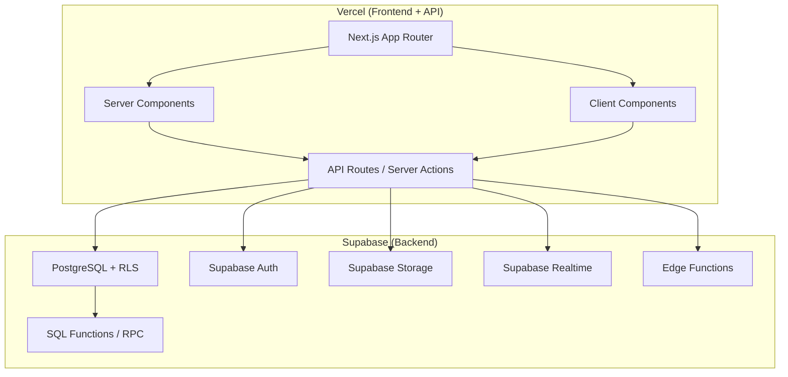
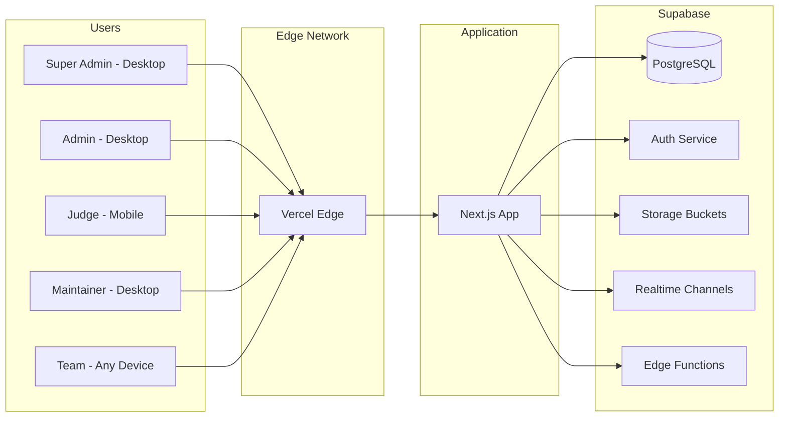
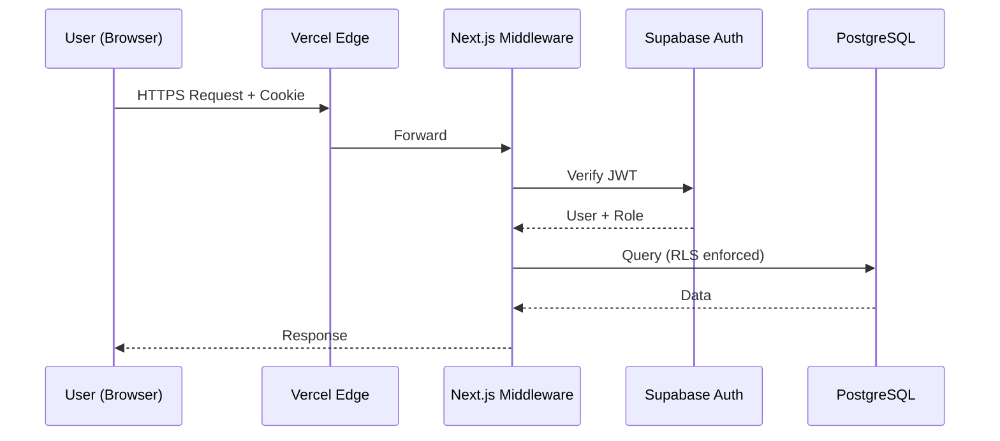
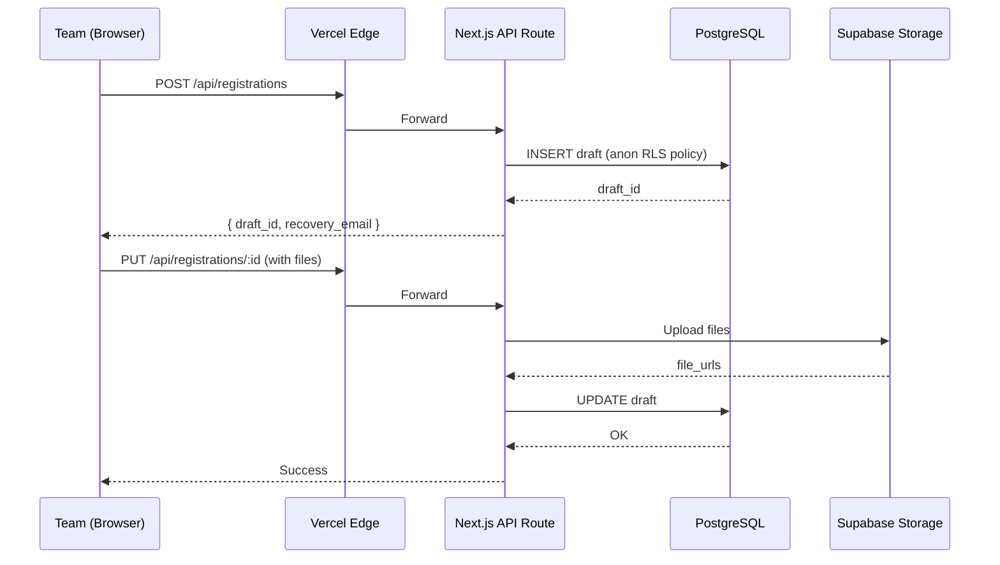
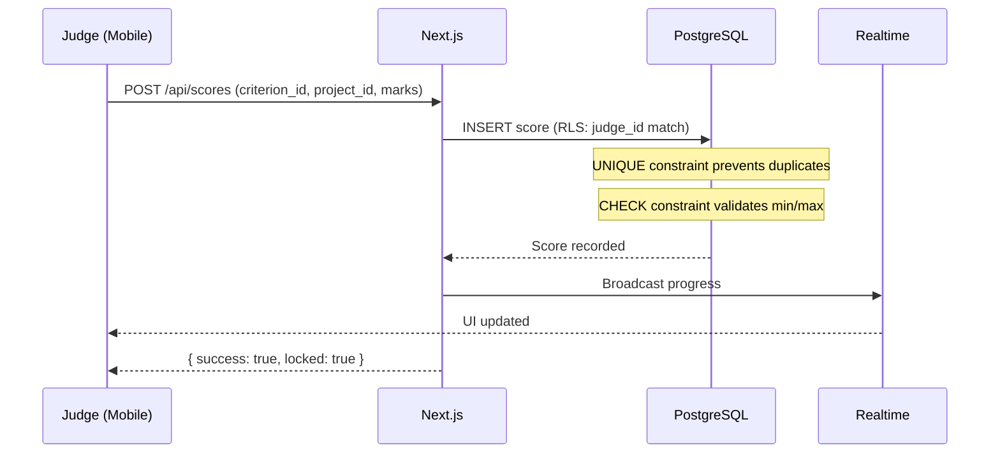

# Architecture Document

## Purpose

Define the system architecture for the Project Judging & Event Evaluation Platform — a self-hosted, modular monolith designed for structured, auditable, and anonymous evaluation of team-based projects at academic events, hackathons, and competitions.

## Scope

This document covers the technology stack, system topology, module boundaries, data flow, deployment targets, and cross-cutting concerns. It is the architectural reference for all other documents.

## Related Documents

- [context.md](context.md) — Vision, principles, roles, constraints
- [plan.md](plan.md) — Phase-based lifecycle
- [userflow.md](userflow.md) — Role-specific workflows
- [database.md](database.md) — Schema, RLS, triggers
- [security.md](security.md) — Auth, RBAC, audit
- [api.md](api.md) — Endpoint specification
- [frontend.md](frontend.md) — Next.js application structure
- [backend.md](backend.md) — Supabase backend configuration
- [deployment.md](deployment.md) — Vercel + Supabase deployment

---

## Technology Stack

| Layer | Technology | Purpose |
|---|---|---|
| Frontend Framework | Next.js 14+ (App Router) | Server/client rendering, routing |
| Language | TypeScript | Type safety across entire codebase |
| Styling | Tailwind CSS | Utility-first responsive design |
| Component Library | shadcn/ui | Accessible, composable UI primitives |
| Backend | Supabase | PostgreSQL, Auth, Storage, Realtime, Edge Functions |
| Database | PostgreSQL (via Supabase) | Relational data with RLS |
| Authentication | Supabase Auth + Google OAuth | SSO for judges/admins; no auth for registration |
| File Storage | Supabase Storage | Submissions, generated PDFs, QR codes |
| Realtime | Supabase Realtime | Live score updates, judge progress tracking |
| Deployment (Frontend) | Vercel | Edge-optimized Next.js hosting |
| Deployment (Backend) | Supabase Cloud | Managed PostgreSQL, Auth, Storage |
| AI (Optional) | Vercel AI SDK | Rubric suggestions, wording, summaries |

---

## Architecture Style

### Modular Monolith

The system is a single deployable Next.js application with clear internal module boundaries. There is no microservice decomposition. All server-side logic executes as Next.js API routes, Server Actions, or Supabase Edge Functions.

### Module Boundaries

| Module | Responsibility |
|---|---|
| `auth` | Google OAuth, session management, role resolution |
| `users` | User CRUD, role assignment, approval workflow |
| `events` | Event lifecycle, configuration, phase transitions |
| `forms` | Dynamic form builder, field types, validation rules |
| `registrations` | Public registration, draft/submit, recovery |
| `teams` | Team management, participant roster |
| `submissions` | File uploads, URL links, custom fields per event |
| `judging` | Judge assignment, project queue, QR scanning |
| `scoring` | Sequential criterion evaluation, immutable scores |
| `results` | Aggregation, ranking, tie-breaking, visibility control |
| `audit` | Action logging, export, compliance |
| `notifications` | Email abstraction, templates, delivery |
| `ai` | Optional rubric/form suggestions, summaries |
| `admin` | Dashboard, system-wide management views |

---

## System Topology

---

## Data Flow Patterns

### 1. Authenticated Request (Judge/Admin/SA)

### 2. Public Registration (No Auth)

### 3. Scoring Flow (Immutable)

---

## Cross-Cutting Concerns

### Authentication & Authorization

- All authenticated routes verify JWT via Supabase Auth.
- Next.js middleware resolves user role from `profiles` table.
- RLS policies enforce row-level access at the database layer.
- Public registration routes use Supabase anon key with restricted RLS.

### Audit Logging

- Every mutation on sensitive tables triggers an audit log INSERT via PostgreSQL trigger.
- Audit logs are append-only (no UPDATE/DELETE RLS policy).
- Logged fields: `actor_id`, `action`, `table_name`, `record_id`, `old_data`, `new_data`, `ip_address`, `timestamp`.

### Error Handling Strategy

| Layer | Strategy |
|---|---|
| Database | CHECK constraints, UNIQUE constraints, trigger-based validation |
| API | Structured error responses: `{ error: string, code: string, details?: object }` |
| Frontend | Error boundaries, toast notifications, form-level validation |
| Network | Retry with exponential backoff for transient failures |

### Realtime

- Used for judge progress dashboards (Admin/SA sees which judges have completed which projects).
- Channel: `event:{event_id}:scores` — broadcasts score submission events.
- Channel: `event:{event_id}:results` — broadcasts when SA releases results.

### File Storage

| Bucket | Access | Content |
|---|---|---|
| `submissions` | Private (RLS) | Team uploads (PDF, DOCX, PPT, ZIP, images) |
| `qr-codes` | Private (RLS) | Generated project QR codes |
| `exports` | Private (SA only) | Audit Excel exports |
| `avatars` | Private (RLS) | User profile images |

### AI Integration (Optional)

- Executed via Vercel AI SDK.
- Never touches scoring or ranking data.
- Use cases: rubric wording suggestions, form field suggestions, email draft generation, result summaries.
- All AI calls are audit-logged.
- AI features gated behind a feature flag.

---

## Scaling Considerations

| Concern | Strategy |
|---|---|
| Concurrent judges | PostgreSQL connection pooling via Supabase (PgBouncer) |
| Large file uploads | Direct-to-Storage upload with signed URLs |
| Score aggregation | SQL materialized views or RPC functions |
| Result computation | Database-level aggregation (no application-level loops) |
| Realtime load | Supabase Realtime with channel-based filtering |

---

## Environment Configuration

| Variable | Description |
|---|---|
| `NEXT_PUBLIC_SUPABASE_URL` | Supabase project URL |
| `NEXT_PUBLIC_SUPABASE_ANON_KEY` | Supabase anonymous key (public) |
| `SUPABASE_SERVICE_ROLE_KEY` | Supabase service role key (server only) |
| `GOOGLE_CLIENT_ID` | Google OAuth client ID |
| `GOOGLE_CLIENT_SECRET` | Google OAuth client secret |
| `NEXT_PUBLIC_APP_URL` | Application base URL |
| `AI_API_KEY` | Optional AI provider key |
| `AI_ENABLED` | Feature flag for AI features |

---

## Key Architectural Decisions

| Decision | Rationale |
|---|---|
| Modular monolith over microservices | Single team, single deployment, reduced operational complexity |
| Supabase over custom backend | Managed PostgreSQL, built-in Auth, Storage, Realtime; minimal DevOps |
| RLS over application-level authorization | Security enforced at database level; defense-in-depth |
| Immutable scores via DB constraints | UNIQUE + no-UPDATE RLS ensures integrity at lowest level |
| Next.js App Router | Server components reduce client bundle; Server Actions simplify mutations |
| shadcn/ui over Material/Ant | Composable, unstyled primitives; full design control with Tailwind |
| Sequential scoring UX | Prevents criterion-skipping; ensures deliberate evaluation |
| QR code scanning for project access | Fast, error-free project identification on mobile |
