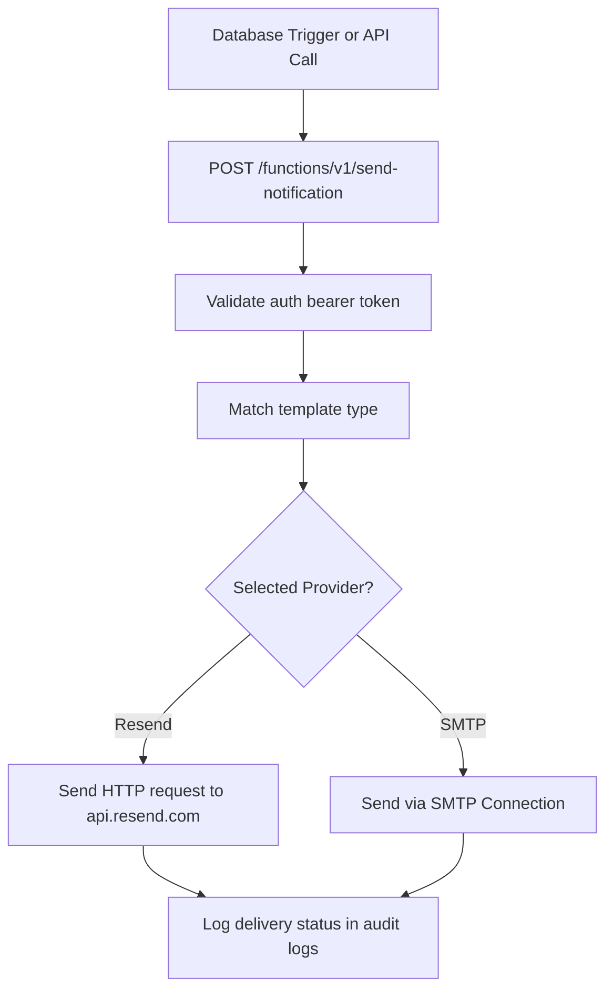

# Backend Implementation Document

## Purpose
Define the server-side configuration, Edge Function structures, transactional email dispatch mechanisms, storage layout engines, and database migration routines.

## Scope
Covers Supabase config files, Postgres triggers, Edge Functions deployment layout, Resend/SendGrid mail providers integration, and migration steps.

## Related Documents
- [database.md](database.md) — SQL tables and schema definition
- [security.md](security.md) — Row Level Security details
- [api.md](api.md) — Endpoint JSON structures

---

## Supabase Directory Layout

The backend configuration is managed as code using the Supabase CLI.

```
supabase/
├── config.toml           # Supabase Project settings
├── migrations/           # Versioned SQL migration files
│   ├── 20260630000000_init.sql
│   └── 20260630000001_scoring_logic.sql
├── functions/            # Supabase Edge Functions (Deno runtime)
│   ├── generate-pdf-qr/  # PDF QR generation service
│   │   ├── index.ts
│   │   └── deno.json
│   ├── send-notification/# Mail dispatcher
│   │   └── index.ts
│   └── shared/           # Utility Deno modules
└── seed.sql              # Development seed data
```

---

## Supabase Edge Functions Specification

Edge Functions are written in TypeScript and run in the Deno runtime environment.

### 1. `generate-pdf-qr`
Triggered by an HTTP POST when the event moves into the `REGISTRATION_CLOSED` status.
- **Role:** Retrieves registration data, generates QR images using the npm `qrcode` package, compiles them into an A4 PDF using `pdfkit`, and saves the file to the `qr-codes` private bucket.
- **Deno Configuration (`deno.json`):**
  ```json
  {
    "imports": {
      "pdfkit": "https://esm.sh/pdfkit@0.13.0",
      "qrcode": "https://esm.sh/qrcode@1.5.1"
    }
  }
  ```

---

### 2. `send-notification`
Responds to PostgreSQL webhook triggers or direct HTTP requests from the API.
- **Role:** Routes notification payloads to the configured email provider (Resend or SMTP relay).
- **Execution Flow:**


---

## Email Template System

Emails use responsive HTML templates with dynamic placeholders.

### Draft Recovery Template Example
- **Subject:** Recover your registration for {{event_name}}
- **Body:**
  ```html
  <!DOCTYPE html>
  <html>
  <body>
    <h2>Draft Recovery Link</h2>
    <p>We received a request to recover your registration draft for <strong>{{event_name}}</strong>.</p>
    <p>Please click the link below to resume editing your form:</p>
    <p><a href="{{recovery_url}}" style="padding: 10px 20px; background-color: #4f46e5; color: #fff; text-decoration: none; border-radius: 5px;">Resume Registration</a></p>
    <p>If you did not request this recovery link, you can safely ignore this email.</p>
    <hr />
    <p>Draft ID: <code>{{draft_id}}</code></p>
  </body>
  </html>
  ```

---

## Storage Buckets Configuration & Security

The system configures four primary buckets, controlled by storage policies.

| Bucket Name | Access Level | Target Extensions | RLS Policy Check |
| :--- | :--- | :--- | :--- |
| `submissions` | Private | `.pdf`, `.docx`, `.zip`, `.png` | Access allowed only if registration is in `DRAFT` status and user holds matching `draft_id`, or if user is Admin/SA. |
| `qr-codes` | Private | `.pdf` | Write operations allowed to internal service-role only. Read access limited to Admin/SA profiles. |
| `exports` | Private | `.xlsx` | Write and read access locked exclusively to Super Admin profile. |
| `avatars` | Public | `.jpg`, `.png` | Read allowed for anyone. Write allowed for authenticated profile owner. |

---

## Migration & Deployment Scripting

To execute backend setup automatically, migrations are run in order.

```bash
#!/usr/bin/env bash
# Deploy script for Supabase Backend infrastructure

set -euo pipefail

echo "Initializing Supabase configuration..."
supabase init

echo "Linking remote project..."
supabase link --project-ref "$SUPABASE_PROJECT_ID"

echo "Applying SQL migrations..."
supabase db push

echo "Deploying Edge Functions..."
supabase fn deploy generate-pdf-qr
supabase fn deploy send-notification

echo "Applying Storage Buckets layout..."
# Note: Storage buckets and RLS policies are created and managed via SQL migrations.

echo "Backend Deployment Completed successfully."
```
