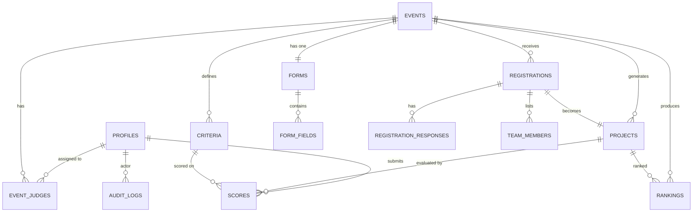

# Database Document

## Purpose
Complete PostgreSQL schema for the Project Judging & Event Evaluation Platform via Supabase. Includes tables, enums, indexes, constraints, RLS policies, triggers, SQL/RPC functions, and storage buckets.

## Related Documents
- [architecture.md](architecture.md) — System topology
- [requirements.md](requirements.md) — Business rules
- [security.md](security.md) — RLS detail
- [api.md](api.md) — Endpoints consuming this schema

---

## Enums

```sql
CREATE TYPE user_role AS ENUM ('SUPER_ADMIN', 'ADMIN', 'JUDGE', 'MAINTAINER');
CREATE TYPE user_status AS ENUM ('PENDING', 'APPROVED', 'SUSPENDED', 'REJECTED');
CREATE TYPE event_type AS ENUM (
  'HACKATHON', 'PROJECT_COMPETITION', 'STARTUP_PITCH', 'ROBOTICS',
  'RESEARCH_PAPER', 'POSTER_PRESENTATION', 'INNOVATION_CHALLENGE', 'CUSTOM'
);
CREATE TYPE event_status AS ENUM (
  'DRAFT', 'PENDING_APPROVAL', 'APPROVED', 'REGISTRATION_OPEN',
  'REGISTRATION_CLOSED', 'JUDGING', 'JUDGING_COMPLETE',
  'RESULTS_PROCESSING', 'RESULTS_READY', 'RESULTS_RELEASED', 'ARCHIVED'
);
CREATE TYPE scoring_precision AS ENUM ('INTEGER', 'DECIMAL');
CREATE TYPE results_visibility AS ENUM ('HIDDEN', 'RANKING_ONLY', 'SELF_SCORE', 'FULL_LEADERBOARD');
CREATE TYPE registration_status AS ENUM ('DRAFT', 'SUBMITTED');
CREATE TYPE field_type AS ENUM (
  'SHORT_TEXT', 'LONG_TEXT', 'EMAIL', 'PHONE', 'NUMBER', 'DROPDOWN',
  'RADIO', 'CHECKBOX', 'DATE', 'TIME', 'FILE_UPLOAD', 'URL', 'SECTION_HEADER'
);
CREATE TYPE audit_action AS ENUM (
  'CREATE', 'UPDATE', 'DELETE', 'APPROVE', 'REJECT', 'VOID',
  'PHASE_TRANSITION', 'LOGIN', 'LOGOUT', 'ROLE_CHANGE', 'DEADLINE_EXTEND',
  'RESULTS_RELEASE', 'SCORE_SUBMIT', 'EXPORT'
);
```

---

## ER Diagram



---

## Tables

### profiles

Extends Supabase `auth.users`. Created via trigger on first login.

```sql
CREATE TABLE profiles (
  id UUID PRIMARY KEY REFERENCES auth.users(id) ON DELETE CASCADE,
  email TEXT UNIQUE NOT NULL,
  full_name TEXT NOT NULL DEFAULT '',
  avatar_url TEXT,
  role user_role NOT NULL DEFAULT 'JUDGE',
  status user_status NOT NULL DEFAULT 'PENDING',
  created_at TIMESTAMPTZ NOT NULL DEFAULT now(),
  updated_at TIMESTAMPTZ NOT NULL DEFAULT now()
);

CREATE INDEX idx_profiles_role ON profiles(role);
CREATE INDEX idx_profiles_status ON profiles(status);
CREATE INDEX idx_profiles_email ON profiles(email);
```

---

### events

```sql
CREATE TABLE events (
  id UUID PRIMARY KEY DEFAULT gen_random_uuid(),
  name TEXT NOT NULL,
  slug TEXT UNIQUE NOT NULL,
  description TEXT NOT NULL DEFAULT '',
  event_type event_type NOT NULL DEFAULT 'CUSTOM',
  status event_status NOT NULL DEFAULT 'DRAFT',
  min_team_size INT NOT NULL DEFAULT 1 CHECK (min_team_size >= 1),
  max_team_size INT NOT NULL DEFAULT 5 CHECK (max_team_size >= min_team_size),
  scoring_precision scoring_precision NOT NULL DEFAULT 'INTEGER',
  results_visibility results_visibility NOT NULL DEFAULT 'HIDDEN',
  registration_deadline TIMESTAMPTZ,
  form_edit_window_end TIMESTAMPTZ,
  judging_start TIMESTAMPTZ,
  judging_end TIMESTAMPTZ,
  allow_late_registration BOOLEAN NOT NULL DEFAULT false,
  created_by UUID NOT NULL REFERENCES profiles(id),
  approved_by UUID REFERENCES profiles(id),
  approval_comment TEXT,
  deleted_at TIMESTAMPTZ,
  created_at TIMESTAMPTZ NOT NULL DEFAULT now(),
  updated_at TIMESTAMPTZ NOT NULL DEFAULT now()
);

CREATE INDEX idx_events_status ON events(status);
CREATE INDEX idx_events_slug ON events(slug);
CREATE INDEX idx_events_created_by ON events(created_by);
```

---

### forms

One form per event.

```sql
CREATE TABLE forms (
  id UUID PRIMARY KEY DEFAULT gen_random_uuid(),
  event_id UUID UNIQUE NOT NULL REFERENCES events(id) ON DELETE CASCADE,
  title TEXT NOT NULL DEFAULT 'Registration Form',
  description TEXT,
  is_locked BOOLEAN NOT NULL DEFAULT false,
  created_at TIMESTAMPTZ NOT NULL DEFAULT now(),
  updated_at TIMESTAMPTZ NOT NULL DEFAULT now()
);
```

---

### form_fields

```sql
CREATE TABLE form_fields (
  id UUID PRIMARY KEY DEFAULT gen_random_uuid(),
  form_id UUID NOT NULL REFERENCES forms(id) ON DELETE CASCADE,
  label TEXT NOT NULL,
  field_type field_type NOT NULL,
  required BOOLEAN NOT NULL DEFAULT false,
  placeholder TEXT,
  help_text TEXT,
  options JSONB DEFAULT '{}',
  validation JSONB DEFAULT '{}',
  sort_order INT NOT NULL DEFAULT 0,
  created_at TIMESTAMPTZ NOT NULL DEFAULT now()
);

CREATE INDEX idx_form_fields_form ON form_fields(form_id);
CREATE INDEX idx_form_fields_order ON form_fields(form_id, sort_order);
```

`options` JSONB examples:
- Dropdown/Radio/Checkbox: `{"choices": ["Option A", "Option B"]}`
- File upload: `{"accepted_types": [".pdf", ".docx"], "max_size_mb": 10}`
- Number: `{"min": 0, "max": 100, "step": 1}`

`validation` JSONB examples:
- `{"max_length": 500}`
- `{"min_date": "2026-01-01"}`

---

### registrations

```sql
CREATE TABLE registrations (
  id UUID PRIMARY KEY DEFAULT gen_random_uuid(),
  event_id UUID NOT NULL REFERENCES events(id),
  draft_id TEXT UNIQUE NOT NULL DEFAULT nanoid(),
  team_name TEXT NOT NULL DEFAULT '',
  recovery_email TEXT,
  status registration_status NOT NULL DEFAULT 'DRAFT',
  submitted_at TIMESTAMPTZ,
  expires_at TIMESTAMPTZ,
  created_at TIMESTAMPTZ NOT NULL DEFAULT now(),
  updated_at TIMESTAMPTZ NOT NULL DEFAULT now()
);

CREATE INDEX idx_registrations_event ON registrations(event_id);
CREATE INDEX idx_registrations_draft ON registrations(draft_id);
CREATE INDEX idx_registrations_status ON registrations(status);
CREATE INDEX idx_registrations_email ON registrations(recovery_email);
```

Note: `nanoid()` is a custom SQL function (see SQL Functions section).

---

### team_members

```sql
CREATE TABLE team_members (
  id UUID PRIMARY KEY DEFAULT gen_random_uuid(),
  registration_id UUID NOT NULL REFERENCES registrations(id) ON DELETE CASCADE,
  name TEXT NOT NULL,
  email TEXT,
  role_in_team TEXT,
  sort_order INT NOT NULL DEFAULT 0
);

CREATE INDEX idx_team_members_registration ON team_members(registration_id);
```

---

### registration_responses

Stores answers to dynamic form fields.

```sql
CREATE TABLE registration_responses (
  id UUID PRIMARY KEY DEFAULT gen_random_uuid(),
  registration_id UUID NOT NULL REFERENCES registrations(id) ON DELETE CASCADE,
  field_id UUID NOT NULL REFERENCES form_fields(id),
  value TEXT,
  file_urls JSONB DEFAULT '[]',
  UNIQUE(registration_id, field_id)
);

CREATE INDEX idx_reg_responses_registration ON registration_responses(registration_id);
```

---

### projects

Generated from submitted registrations. This is what judges see.

```sql
CREATE TABLE projects (
  id UUID PRIMARY KEY DEFAULT gen_random_uuid(),
  event_id UUID NOT NULL REFERENCES events(id),
  registration_id UUID UNIQUE NOT NULL REFERENCES registrations(id),
  project_number INT NOT NULL,
  title TEXT NOT NULL,
  abstract TEXT NOT NULL DEFAULT '',
  qr_code_url TEXT,
  created_at TIMESTAMPTZ NOT NULL DEFAULT now(),
  UNIQUE(event_id, project_number)
);

CREATE INDEX idx_projects_event ON projects(event_id);
```

---

### criteria

```sql
CREATE TABLE criteria (
  id UUID PRIMARY KEY DEFAULT gen_random_uuid(),
  event_id UUID NOT NULL REFERENCES events(id) ON DELETE CASCADE,
  name TEXT NOT NULL,
  description TEXT NOT NULL DEFAULT '',
  min_marks NUMERIC(6,2) NOT NULL DEFAULT 0 CHECK (min_marks >= 0),
  max_marks NUMERIC(6,2) NOT NULL CHECK (max_marks > min_marks),
  weight NUMERIC(5,2) NOT NULL DEFAULT 1.0 CHECK (weight > 0),
  sort_order INT NOT NULL DEFAULT 0,
  created_at TIMESTAMPTZ NOT NULL DEFAULT now()
);

CREATE INDEX idx_criteria_event ON criteria(event_id);
CREATE INDEX idx_criteria_order ON criteria(event_id, sort_order);
```

---

### scores

The most critical table. Immutable by design.

```sql
CREATE TABLE scores (
  id UUID PRIMARY KEY DEFAULT gen_random_uuid(),
  judge_id UUID NOT NULL REFERENCES profiles(id),
  project_id UUID NOT NULL REFERENCES projects(id),
  criterion_id UUID NOT NULL REFERENCES criteria(id),
  event_id UUID NOT NULL REFERENCES events(id),
  marks NUMERIC(6,2) NOT NULL,
  voided BOOLEAN NOT NULL DEFAULT false,
  voided_by UUID REFERENCES profiles(id),
  voided_at TIMESTAMPTZ,
  void_reason TEXT,
  created_at TIMESTAMPTZ NOT NULL DEFAULT now(),
  UNIQUE(judge_id, project_id, criterion_id) 
);

CREATE INDEX idx_scores_judge ON scores(judge_id);
CREATE INDEX idx_scores_project ON scores(project_id);
CREATE INDEX idx_scores_event ON scores(event_id);
CREATE INDEX idx_scores_judge_project ON scores(judge_id, project_id);
```

**Immutability Strategy:**
- UNIQUE constraint on `(judge_id, project_id, criterion_id)` prevents duplicate scoring.
- RLS: INSERT allowed for judge's own scores. UPDATE allowed ONLY for SA setting `voided = true`.
- No DELETE policy for any role.
- Application never issues UPDATE on `marks` column.

---

### event_judges

```sql
CREATE TABLE event_judges (
  id UUID PRIMARY KEY DEFAULT gen_random_uuid(),
  event_id UUID NOT NULL REFERENCES events(id) ON DELETE CASCADE,
  judge_id UUID NOT NULL REFERENCES profiles(id),
  assigned_at TIMESTAMPTZ NOT NULL DEFAULT now(),
  UNIQUE(event_id, judge_id)
);

CREATE INDEX idx_event_judges_event ON event_judges(event_id);
CREATE INDEX idx_event_judges_judge ON event_judges(judge_id);
```

---

### rankings

```sql
CREATE TABLE rankings (
  id UUID PRIMARY KEY DEFAULT gen_random_uuid(),
  event_id UUID NOT NULL REFERENCES events(id),
  project_id UUID NOT NULL REFERENCES projects(id),
  total_score NUMERIC(10,2) NOT NULL DEFAULT 0,
  average_score NUMERIC(10,2) NOT NULL DEFAULT 0,
  rank INT NOT NULL,
  is_tied BOOLEAN NOT NULL DEFAULT false,
  computed_at TIMESTAMPTZ NOT NULL DEFAULT now(),
  UNIQUE(event_id, project_id)
);

CREATE INDEX idx_rankings_event ON rankings(event_id);
CREATE INDEX idx_rankings_rank ON rankings(event_id, rank);
```

---

### audit_logs

Append-only. No UPDATE or DELETE allowed.

```sql
CREATE TABLE audit_logs (
  id UUID PRIMARY KEY DEFAULT gen_random_uuid(),
  actor_id UUID REFERENCES profiles(id),
  action audit_action NOT NULL,
  table_name TEXT,
  record_id UUID,
  old_data JSONB,
  new_data JSONB,
  ip_address INET,
  user_agent TEXT,
  reason TEXT,
  created_at TIMESTAMPTZ NOT NULL DEFAULT now()
);

CREATE INDEX idx_audit_actor ON audit_logs(actor_id);
CREATE INDEX idx_audit_action ON audit_logs(action);
CREATE INDEX idx_audit_table ON audit_logs(table_name);
CREATE INDEX idx_audit_created ON audit_logs(created_at DESC);
```

---

## RLS Policies

### profiles

```sql
ALTER TABLE profiles ENABLE ROW LEVEL SECURITY;

-- Anyone can read approved profiles
CREATE POLICY "profiles_select" ON profiles FOR SELECT
  USING (status = 'APPROVED' OR auth.uid() = id OR
    EXISTS (SELECT 1 FROM profiles WHERE id = auth.uid() AND role IN ('SUPER_ADMIN', 'ADMIN')));

-- Users can update own profile (name, avatar only)
CREATE POLICY "profiles_update_self" ON profiles FOR UPDATE
  USING (auth.uid() = id)
  WITH CHECK (auth.uid() = id AND role = OLD.role AND status = OLD.status);

-- SA can update any profile
CREATE POLICY "profiles_update_sa" ON profiles FOR UPDATE
  USING (EXISTS (SELECT 1 FROM profiles WHERE id = auth.uid() AND role = 'SUPER_ADMIN'));

-- Admin can update judge status (approve/reject)
CREATE POLICY "profiles_update_admin" ON profiles FOR UPDATE
  USING (EXISTS (SELECT 1 FROM profiles WHERE id = auth.uid() AND role = 'ADMIN'))
  WITH CHECK (role = 'JUDGE' AND status IN ('APPROVED', 'REJECTED'));
```

### events

```sql
ALTER TABLE events ENABLE ROW LEVEL SECURITY;

CREATE POLICY "events_select" ON events FOR SELECT
  USING (deleted_at IS NULL AND (
    EXISTS (SELECT 1 FROM profiles WHERE id = auth.uid() AND role IN ('SUPER_ADMIN', 'ADMIN'))
    OR (status IN ('REGISTRATION_OPEN', 'RESULTS_RELEASED'))
    OR (status = 'JUDGING' AND EXISTS (
      SELECT 1 FROM event_judges WHERE event_id = events.id AND judge_id = auth.uid()))
  ));

CREATE POLICY "events_insert" ON events FOR INSERT
  WITH CHECK (EXISTS (SELECT 1 FROM profiles WHERE id = auth.uid() AND role IN ('SUPER_ADMIN', 'ADMIN')));

CREATE POLICY "events_update" ON events FOR UPDATE
  USING (EXISTS (SELECT 1 FROM profiles WHERE id = auth.uid() AND role IN ('SUPER_ADMIN', 'ADMIN')));
```

### scores

```sql
ALTER TABLE scores ENABLE ROW LEVEL SECURITY;

-- Judges can read their own scores
CREATE POLICY "scores_select_judge" ON scores FOR SELECT
  USING (judge_id = auth.uid());

-- SA/Admin can read all scores
CREATE POLICY "scores_select_admin" ON scores FOR SELECT
  USING (EXISTS (SELECT 1 FROM profiles WHERE id = auth.uid() AND role IN ('SUPER_ADMIN', 'ADMIN')));

-- Judge can insert own scores only
CREATE POLICY "scores_insert" ON scores FOR INSERT
  WITH CHECK (
    judge_id = auth.uid()
    AND EXISTS (SELECT 1 FROM profiles WHERE id = auth.uid() AND role = 'JUDGE' AND status = 'APPROVED')
    AND EXISTS (SELECT 1 FROM event_judges WHERE event_id = scores.event_id AND judge_id = auth.uid())
    AND EXISTS (SELECT 1 FROM events WHERE id = scores.event_id AND status = 'JUDGING')
  );

-- Only SA can void scores (update voided flag only)
CREATE POLICY "scores_void_sa" ON scores FOR UPDATE
  USING (EXISTS (SELECT 1 FROM profiles WHERE id = auth.uid() AND role = 'SUPER_ADMIN'))
  WITH CHECK (voided = true);

-- No DELETE policy (scores can never be deleted)
```

### registrations (public access)

```sql
ALTER TABLE registrations ENABLE ROW LEVEL SECURITY;

-- Public can insert drafts (anon key)
CREATE POLICY "registrations_insert_public" ON registrations FOR INSERT
  WITH CHECK (status = 'DRAFT');

-- Public can read/update own drafts via draft_id (handled via RPC)
CREATE POLICY "registrations_select_public" ON registrations FOR SELECT USING (true);

-- Admin/SA can read all
CREATE POLICY "registrations_select_admin" ON registrations FOR SELECT
  USING (EXISTS (SELECT 1 FROM profiles WHERE id = auth.uid() AND role IN ('SUPER_ADMIN', 'ADMIN')));
```

### audit_logs

```sql
ALTER TABLE audit_logs ENABLE ROW LEVEL SECURITY;

-- Only SA can read
CREATE POLICY "audit_select_sa" ON audit_logs FOR SELECT
  USING (EXISTS (SELECT 1 FROM profiles WHERE id = auth.uid() AND role = 'SUPER_ADMIN'));

-- Insert via trigger only (service role)
CREATE POLICY "audit_insert" ON audit_logs FOR INSERT
  WITH CHECK (true);

-- No UPDATE or DELETE policies
```

---

## Triggers

### Auto-create profile on signup

```sql
CREATE OR REPLACE FUNCTION handle_new_user()
RETURNS TRIGGER AS $$
BEGIN
  INSERT INTO profiles (id, email, full_name, avatar_url)
  VALUES (
    NEW.id,
    NEW.email,
    COALESCE(NEW.raw_user_meta_data->>'full_name', NEW.email),
    NEW.raw_user_meta_data->>'avatar_url'
  );
  RETURN NEW;
END;
$$ LANGUAGE plpgsql SECURITY DEFINER;

CREATE TRIGGER on_auth_user_created
  AFTER INSERT ON auth.users
  FOR EACH ROW EXECUTE FUNCTION handle_new_user();
```

### Auto-update `updated_at`

```sql
CREATE OR REPLACE FUNCTION update_updated_at()
RETURNS TRIGGER AS $$
BEGIN
  NEW.updated_at = now();
  RETURN NEW;
END;
$$ LANGUAGE plpgsql;

CREATE TRIGGER set_updated_at BEFORE UPDATE ON profiles
  FOR EACH ROW EXECUTE FUNCTION update_updated_at();
CREATE TRIGGER set_updated_at BEFORE UPDATE ON events
  FOR EACH ROW EXECUTE FUNCTION update_updated_at();
CREATE TRIGGER set_updated_at BEFORE UPDATE ON forms
  FOR EACH ROW EXECUTE FUNCTION update_updated_at();
CREATE TRIGGER set_updated_at BEFORE UPDATE ON registrations
  FOR EACH ROW EXECUTE FUNCTION update_updated_at();
```

### Audit log trigger (generic)

```sql
CREATE OR REPLACE FUNCTION audit_trigger_func()
RETURNS TRIGGER AS $$
BEGIN
  INSERT INTO audit_logs (actor_id, action, table_name, record_id, old_data, new_data)
  VALUES (
    auth.uid(),
    CASE TG_OP WHEN 'INSERT' THEN 'CREATE' WHEN 'UPDATE' THEN 'UPDATE' WHEN 'DELETE' THEN 'DELETE' END::audit_action,
    TG_TABLE_NAME,
    COALESCE(NEW.id, OLD.id),
    CASE WHEN TG_OP != 'INSERT' THEN to_jsonb(OLD) END,
    CASE WHEN TG_OP != 'DELETE' THEN to_jsonb(NEW) END
  );
  RETURN COALESCE(NEW, OLD);
END;
$$ LANGUAGE plpgsql SECURITY DEFINER;

-- Apply to sensitive tables
CREATE TRIGGER audit_events AFTER INSERT OR UPDATE OR DELETE ON events
  FOR EACH ROW EXECUTE FUNCTION audit_trigger_func();
CREATE TRIGGER audit_scores AFTER INSERT OR UPDATE ON scores
  FOR EACH ROW EXECUTE FUNCTION audit_trigger_func();
CREATE TRIGGER audit_profiles AFTER UPDATE ON profiles
  FOR EACH ROW EXECUTE FUNCTION audit_trigger_func();
```

---

## SQL / RPC Functions

### nanoid() — Generate short unique IDs for draft_id

```sql
CREATE OR REPLACE FUNCTION nanoid(size INT DEFAULT 12)
RETURNS TEXT AS $$
DECLARE
  chars TEXT := 'ABCDEFGHIJKLMNOPQRSTUVWXYZabcdefghijklmnopqrstuvwxyz0123456789';
  result TEXT := '';
  i INT;
BEGIN
  FOR i IN 1..size LOOP
    result := result || substr(chars, floor(random() * length(chars) + 1)::int, 1);
  END LOOP;
  RETURN result;
END;
$$ LANGUAGE plpgsql;
```

### compute_rankings(event_uuid)

```sql
CREATE OR REPLACE FUNCTION compute_rankings(p_event_id UUID)
RETURNS VOID AS $$
BEGIN
  DELETE FROM rankings WHERE event_id = p_event_id;

  INSERT INTO rankings (event_id, project_id, total_score, average_score, rank, is_tied)
  SELECT
    p_event_id,
    s.project_id,
    SUM(s.marks * c.weight) AS total_score,
    AVG(SUM(s.marks * c.weight)) OVER (PARTITION BY s.project_id) AS average_score,
    RANK() OVER (ORDER BY SUM(s.marks * c.weight) DESC) AS rank,
    COUNT(*) OVER (PARTITION BY RANK() OVER (ORDER BY SUM(s.marks * c.weight) DESC)) > 1 AS is_tied
  FROM scores s
  JOIN criteria c ON c.id = s.criterion_id
  WHERE s.event_id = p_event_id AND s.voided = false
  GROUP BY s.project_id, s.judge_id
  ORDER BY rank;
END;
$$ LANGUAGE plpgsql SECURITY DEFINER;
```

### get_judge_progress(judge_uuid, event_uuid)

```sql
CREATE OR REPLACE FUNCTION get_judge_progress(p_judge_id UUID, p_event_id UUID)
RETURNS TABLE (
  project_id UUID,
  project_title TEXT,
  criteria_total INT,
  criteria_scored INT,
  is_complete BOOLEAN
) AS $$
BEGIN
  RETURN QUERY
  SELECT
    p.id AS project_id,
    p.title AS project_title,
    (SELECT COUNT(*)::INT FROM criteria WHERE event_id = p_event_id) AS criteria_total,
    (SELECT COUNT(*)::INT FROM scores WHERE judge_id = p_judge_id AND project_id = p.id AND voided = false) AS criteria_scored,
    (SELECT COUNT(*)::INT FROM scores WHERE judge_id = p_judge_id AND project_id = p.id AND voided = false) =
      (SELECT COUNT(*)::INT FROM criteria WHERE event_id = p_event_id) AS is_complete
  FROM projects p
  WHERE p.event_id = p_event_id;
END;
$$ LANGUAGE plpgsql SECURITY DEFINER;
```

### validate_sequential_scoring()

Trigger to enforce sequential criterion scoring.

```sql
CREATE OR REPLACE FUNCTION validate_sequential_scoring()
RETURNS TRIGGER AS $$
DECLARE
  criterion_order INT;
  prev_scored BOOLEAN;
BEGIN
  SELECT sort_order INTO criterion_order FROM criteria WHERE id = NEW.criterion_id;

  IF criterion_order > 0 THEN
    SELECT EXISTS (
      SELECT 1 FROM scores s
      JOIN criteria c ON c.id = s.criterion_id
      WHERE s.judge_id = NEW.judge_id
        AND s.project_id = NEW.project_id
        AND c.sort_order = criterion_order - 1
        AND s.voided = false
    ) INTO prev_scored;

    IF NOT prev_scored THEN
      RAISE EXCEPTION 'Previous criterion must be scored first';
    END IF;
  END IF;

  RETURN NEW;
END;
$$ LANGUAGE plpgsql;

CREATE TRIGGER enforce_sequential_scoring
  BEFORE INSERT ON scores
  FOR EACH ROW EXECUTE FUNCTION validate_sequential_scoring();
```

---

## Storage Buckets

| Bucket | Access | Purpose |
|---|---|---|
| `submissions` | Private; RLS per registration | Team file uploads |
| `qr-codes` | Private; Admin/SA read | Generated QR code images |
| `exports` | Private; SA only | Audit Excel exports |
| `avatars` | Public read; owner write | Profile images |

---

## Migration Order

1. Create enums
2. Create `profiles` table + trigger
3. Create `events` table
4. Create `forms` + `form_fields`
5. Create `registrations` + `team_members` + `registration_responses`
6. Create `projects`
7. Create `criteria`
8. Create `scores` + sequential scoring trigger
9. Create `event_judges`
10. Create `rankings`
11. Create `audit_logs` + audit triggers
12. Apply RLS policies
13. Create RPC functions
14. Create storage buckets + policies
