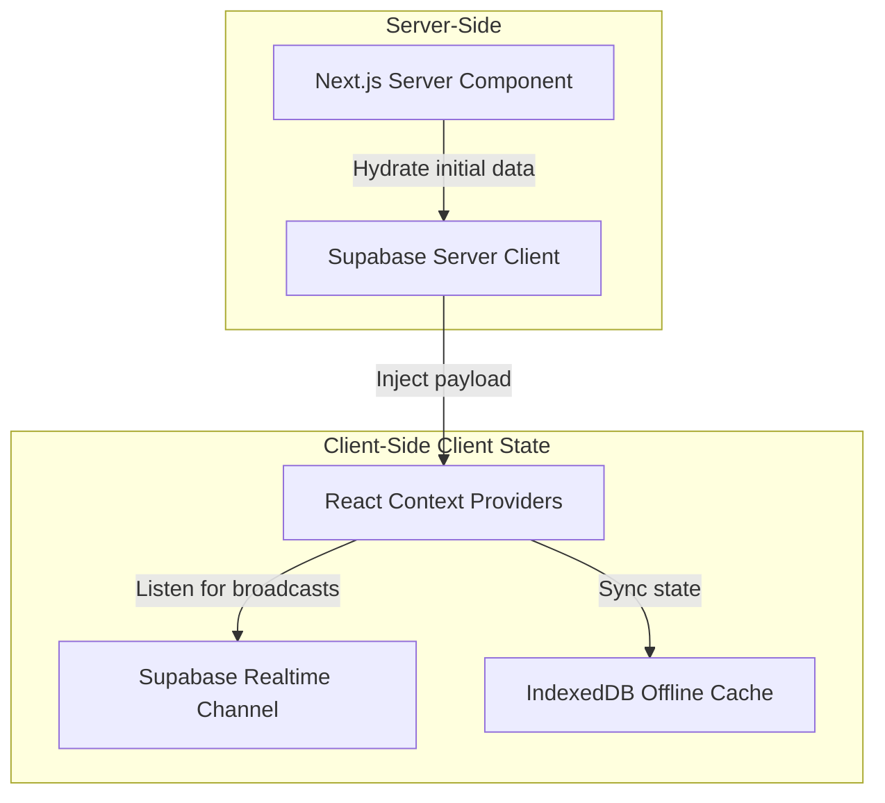

# Frontend Architecture Document

## Purpose
Specify the directory layout, module dependencies, styling guidelines, state management strategies, routing rules, and performance budgets for the Next.js Web App.

## Scope
Covers the setup of the Next.js App Router, Tailwind CSS styling systems, component packaging, data hydration techniques, and accessibility requirements.

## Related Documents
- [architecture.md](architecture.md) — Modular monolith topology
- [ui-spec.md](ui-spec.md) — Visual page-by-page design rules
- [api.md](api.md) — Backend API contracts

---

## Directory Structure

The Next.js client application follows a feature-grouped directory structure within the `src/` directory.

```
src/
├── app/                  # Next.js App Router root
│   ├── (auth)/           # Authentication layout and login routes
│   ├── (admin)/          # Admin/SA protected dashboard and management routes
│   ├── (judge)/          # Judge mobile-optimized interface
│   ├── register/         # Public registration dynamic form routes
│   ├── api/              # Internal API proxy routes
│   ├── layout.tsx        # Root HTML shell
│   └── page.tsx          # Public landing page
├── components/           # Reusable shared UI components
│   ├── ui/               # shadcn/ui components (primitive elements)
│   ├── form/             # Dynamic form-rendering widgets
│   ├── layout/           # Shared navigation and layout shells
│   └── feedback/         # Loading, empty, and error fallback widgets
├── hooks/                # Custom React hook utilities (useAuth, useOffline, etc.)
├── lib/                  # Library initializers and utilities
│   ├── supabase/         # Client and server Supabase context engines
│   ├── utils/            # General helpers (formatters, style wrappers)
│   └── ai/               # Vercel AI SDK runtime initializers
├── services/             # Client-side API request abstractions
└── types/                # Strict TypeScript declaration files
```

---

## Technical Stack & Libraries

- **Framework:** Next.js 14+ (App Router, using Server Actions and Server Components where applicable).
- **Core Language:** TypeScript (Enforces strict compiler checks, absolute type coverage).
- **Styling:** Tailwind CSS + `tailwind-merge` + `clsx` for dynamic style compositions.
- **Component Primitives:** shadcn/ui (derived from Radix UI for accessibility and accessibility compliance).
- **Icons:** `lucide-react`.
- **Forms:** React Hook Form + Zod (for validation parsing).
- **Offline / Local State Cache:** `idb` (IndexedDB wrapper library for browser caching).
- **Realtime Listener:** Supabase Client Realtime SDK.
- **AI UI Utilities:** Vercel AI SDK (`ai` NPM library).

---

## State Management & Hydration Strategy

To minimize loading flashes and optimize performance, the frontend divides state into three layers:



1. **Server-Side Data Retrieval:** Initial layouts and dashboard states are fetched via Next.js Server Components. Auth validation is executed on the server, avoiding cumulative layout shifts.
2. **Client-Side Realtime Synced State:** Components requiring live updates (e.g. Judge progress, Leaderboard status) subscribe to Supabase Realtime Channels within a React Context provider.
3. **Local Store (Offline/Judging):** The judging dashboard hydatrates data from IndexedDB when network connectivity is lost, maintaining user state in local memory.

---

## Routing & Layouts

Layouts are grouped via Next.js route groups `(auth)`, `(admin)`, and `(judge)` to enforce role-specific visual architectures.

### Route Permissions & Middleware Verification
Next.js Edge Middleware (`src/middleware.ts`) inspects the Supabase JWT cookie on every navigation event.

```typescript
// Pseudocode outline of Middleware authorization enforcement
export async function middleware(req: NextRequest) {
  const res = NextResponse.next();
  const supabase = createMiddlewareClient({ req, res });
  const { data: { session } } = await supabase.auth.getSession();

  const url = req.nextUrl.clone();
  
  if (!session && isProtectedRoute(url.pathname)) {
    url.pathname = '/login';
    return NextResponse.redirect(url);
  }

  if (session) {
    const role = session.user.app_metadata.role;
    if (isAdminRoute(url.pathname) && role !== 'SUPER_ADMIN' && role !== 'ADMIN') {
      url.pathname = '/forbidden';
      return NextResponse.redirect(url);
    }
  }

  return res;
}
```

---

## Styling & Design System

The application uses Tailwind CSS. The design system is set to dark-mode by default for administrative interfaces, with responsive design structures for mobile judging modules.

### Palette Config (`tailwind.config.js`)
```javascript
module.exports = {
  theme: {
    extend: {
      colors: {
        background: 'var(--background)', // slate-950
        foreground: 'var(--foreground)', // slate-50
        primary: {
          DEFAULT: 'var(--primary)',     // indigo-500
          foreground: 'var(--primary-foreground)',
        },
        secondary: {
          DEFAULT: 'var(--secondary)',   // violet-500
          foreground: 'var(--secondary-foreground)',
        },
        muted: 'var(--muted)',           // slate-800
        accent: 'var(--accent)',         // emerald-500
        destructive: 'var(--destructive)'// rose-600
      }
    }
  }
}
```

---

## Performance Budgets

To maintain high responsiveness on mobile devices, the following build-size constraints are enforced:

| Asset / Metric | Budget Limit | Action on Exception |
| :--- | :--- | :--- |
| **First Load JS (Page)** | < 120 KB (Gzipped) | Refactor imports, load heavy utilities asynchronously |
| **Lighthouse Performance Score**| > 90 / 100 | Optimize images, run bundle analysis |
| **Time to Interactive (TTI)** | < 2.5 seconds | Optimize Server Actions and disable heavy blocking scripts |
| **Total Bundle Size** | < 450 KB | Audit dependencies |
