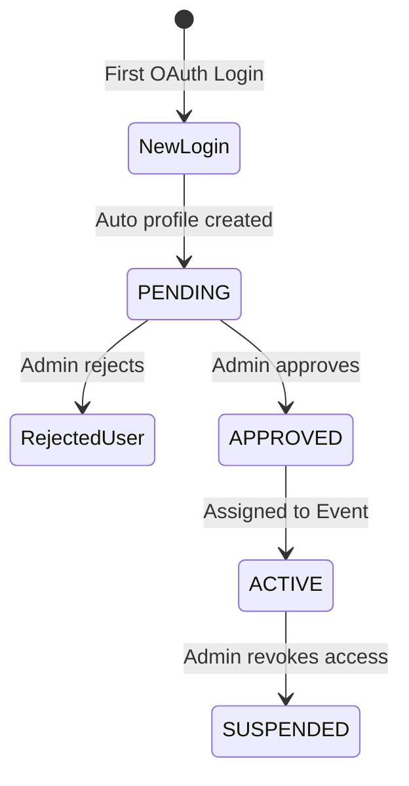
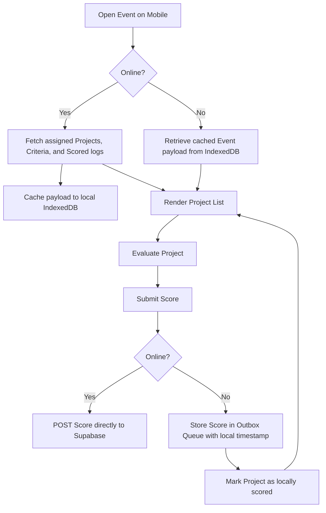

# Judging Engine Document

## Purpose
Define the onboarding process for judges, the assignment constraints, details of anonymous evaluation, and the technical mechanics of the QR-based project identification and mobile interface caching.

## Scope
Covers credentials validation, offline queue management, the QR code generation workflow, and synchronization mechanisms between the client application and Supabase databases.

## Related Documents
- [requirements.md](requirements.md) — Functional definitions of judging limits
- [database.md](database.md) — Schema for criteria, scores, and event judges
- [security.md](security.md) — RLS rules limiting access to project metadata

---

## Judge Onboarding & Approval Flow

Judges register using Google OAuth. Access control requires manual administrator approval to prevent unauthorized logins.

- **Pending State:** If status is `PENDING`, the user sees a splash screen: "Awaiting Administration Approval". The Next.js middleware rejects all backend API calls targeting criteria, projects, or scores.
- **Approved State:** Profile status changes to `APPROVED`. RLS allows the judge to read assigned event configurations.

---

## Assignment and Anonymization Logic

The platform strictly enforces anonymous evaluation to eliminate bias.

### Anonymous View Constraints
Judges see projects via the `anonymized_projects` projection.

| Field | Visible to Judge | Description |
| :--- | :---: | :--- |
| `id` | Yes | Unique UUID for scoring reference |
| `project_number` | Yes | Display integer identifier |
| `title` | Yes | Project title |
| `abstract` | Yes | Descriptive project abstract |
| `team_name` | No | Redacted database layer filter |
| `team_members` | No | Redacted database layer filter |
| `registration_responses`| No | Redacted database layer filter |

### Assignment Scope
- **All-to-All:** Every approved judge assigned to an event must evaluate every active project in that event.
- **Progress Tracking:** The dashboard renders a progress bar calculating `completed_evaluations / total_projects` dynamically via database RPC.

---

## QR Code System & Printable PDFs

To facilitate fast project lookup during live showcase events, projects are accessed via QR codes.

### QR Code Metadata Payload
Each project's QR code encodes a secure URL directing to the judge evaluation screen:
`${NEXT_PUBLIC_APP_URL}/eval/scan?project_id={project_id}`

### PDF Layout Specification
Upon closing the registration phase, administrators can download a consolidated PDF of QR codes.
- **Format:** Standard A4 size.
- **Layout Options:**
  - *Single Poster:* One project QR + Title + Abstract per sheet.
  - *Grid Sheets:* 2x3 grid of badges containing project number, title, and QR code.
- **Storage:** Pre-rendered via a Supabase Edge Function using `pdfkit` and saved inside the `qr-codes` private bucket for Admin retrieval.

---

## Offline Caching & Mobile UX Design

Since event venues often suffer from unstable network connections, the judge interface implements local data buffering.

### Mobile Caching Engine (IndexedDB / localStorage)
When the judge opens an assigned event while online, the system pre-fetches the event state.

### Outbox Sync Algorithm
When network connectivity is restored:
1. The background worker scans the Outbox Queue.
2. Items are processed sequentially (FIFO).
3. The client POSTs the score: `/api/scores/submit`.
4. If a conflict error (409) returns (indicating the database already contains a score for this project-criterion combo), the client drops the local entry and updates the status.
5. Once all items are successfully processed, the queue is cleared.
