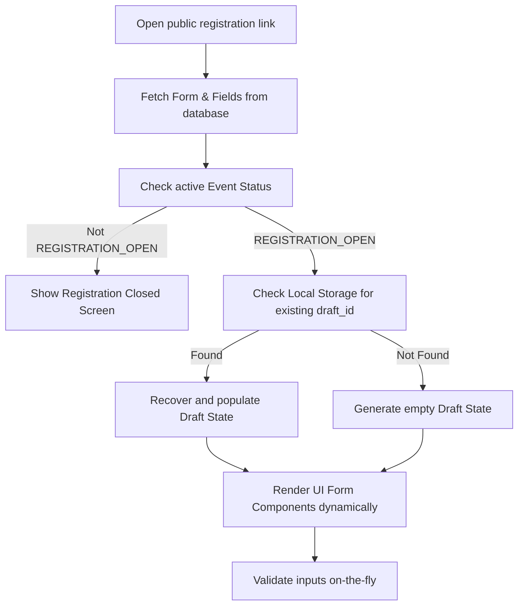
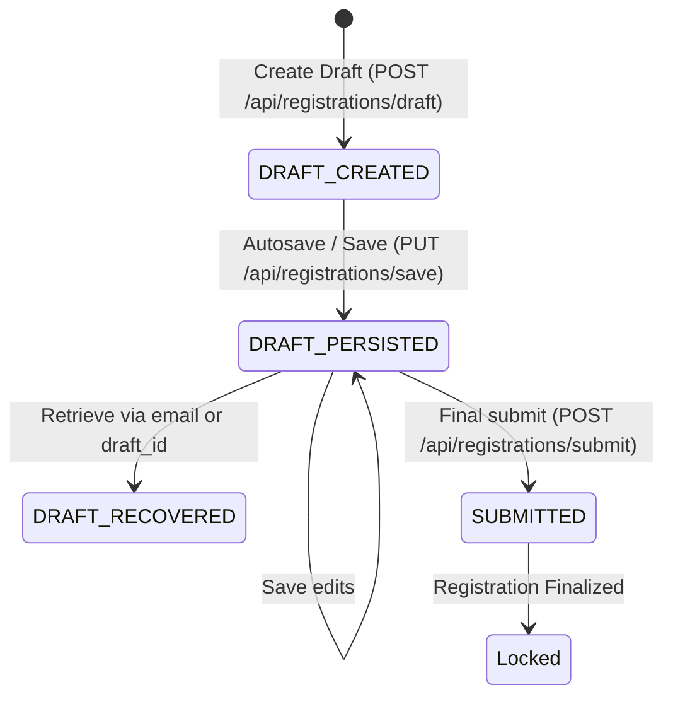
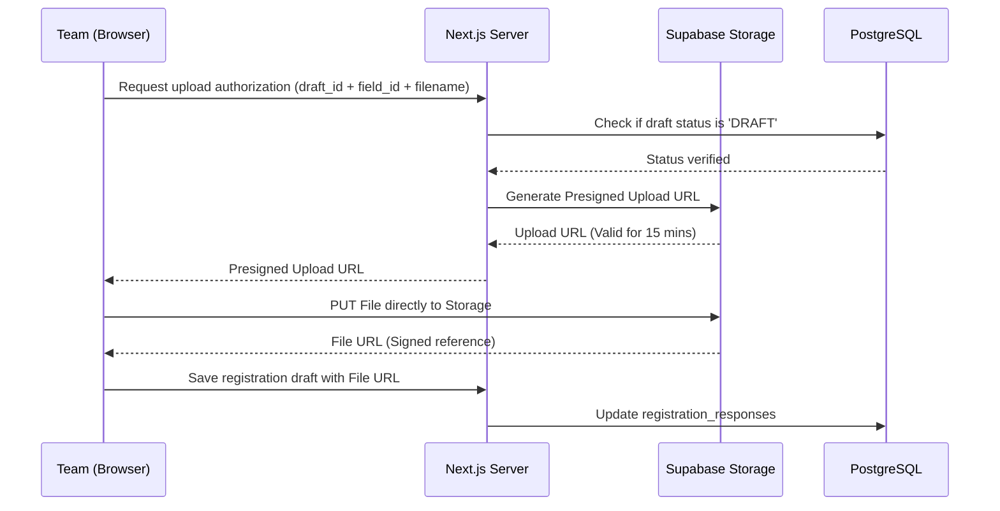

# Registration Engine Document

## Purpose
Define the design, dynamic rendering architecture, validation rules, lock windows, draft persistence, recovery mechanics, and file submission workflows for the public registration module.

## Scope
Covers the Google Forms-like form builder, the JSON configuration schema, draft management, email recovery options, submission validation, and storage routing.

## Related Documents
- [requirements.md](requirements.md) — Functional specifications
- [database.md](database.md) — Form and Registration schemas
- [api.md](api.md) — Public registration endpoints

---

## Form Builder Configuration Schema

Super Admins construct forms dynamically. The structure is saved as relational rows inside `form_fields` but modeled on the client as a JSON array of fields.

### JSON representation of a dynamic form
```json
[
  {
    "id": "d044f128-44fa-4ce8-b611-a89e8122bb11",
    "label": "Project Title",
    "field_type": "SHORT_TEXT",
    "required": true,
    "placeholder": "Enter your project title",
    "help_text": "Maximum 100 characters.",
    "options": {},
    "validation": {
      "max_length": 100
    },
    "sort_order": 0
  },
  {
    "id": "e155a299-55ab-4de9-c722-b90f9233cc22",
    "label": "Project Abstract",
    "field_type": "LONG_TEXT",
    "required": true,
    "placeholder": "Briefly describe your project...",
    "help_text": "Describe the core problem solved, methodology, and results.",
    "options": {},
    "validation": {
      "max_length": 1000
    },
    "sort_order": 1
  },
  {
    "id": "f266b300-66bc-4ef0-d833-c91f0344dd33",
    "label": "Project Category",
    "field_type": "DROPDOWN",
    "required": true,
    "placeholder": "Select a category",
    "help_text": "",
    "options": {
      "choices": ["Software", "Hardware", "IoT", "AI/ML", "General"]
    },
    "validation": {},
    "sort_order": 2
  },
  {
    "id": "a377c411-77cd-4f01-e944-d82f1455ee44",
    "label": "Project Files (Presentation & Proposal)",
    "field_type": "FILE_UPLOAD",
    "required": false,
    "placeholder": "",
    "help_text": "Upload project presentation slides or report. PDFs only. Max 10MB.",
    "options": {
      "accepted_types": [".pdf"],
      "max_size_mb": 10
    },
    "validation": {},
    "sort_order": 3
  }
]
```

---

## The Dynamic Form Render Pipeline

The frontend dynamically interprets the field definitions and binds them to validation rules.



---

## Form Editing Constraints (Lock Logic)

To prevent breaking data structures after teams have submitted registration forms, strict editing constraints are applied at the database level.

### Lock Rule Definitions
- **Form Edit Window:** Forms can only be modified for **1–2 days after publication** (configured on the `events` table via the `form_edit_window_end` timestamp).
- **Hard Lock:** Once the `form_edit_window_end` passes, or the first registration draft changes status to `SUBMITTED`, the form structure is locked.
- **Structure Mutations Allowed:** Only the Super Admin can add fields or change field orders after lock by explicitly extending the registration deadline or form edit window. Extensions are audit-logged.
- **Locked Parameters:** If `is_locked = true` in the `forms` table, database triggers reject any `INSERT`, `UPDATE`, or `DELETE` requests on `form_fields` containing the affected `form_id`.

---

## Draft Persistence & recovery Mechanics

Teams can work on their registration in drafts before committing to final submission.

### Draft Lifecycle State Machine


### Recovery Methods
1. **Direct Link:** Saved locally on the team lead's machine via cookie or localStorage: `/register/{event_slug}?draft={draft_id}`.
2. **Email Recovery Flow:**
   - User inputs recovery email.
   - Server triggers a transactional email containing the recovery URL.
   - Link retrieves the state from `/api/registrations/recover?draft_id={draft_id}`.

---

## File Upload Flow & Storage Configuration

Files are sent directly from the client to Supabase Storage using securely generated client-side upload keys or authenticated routes.

### Upload Workflow Sequence


### Storage Folder Architecture
- **Root Bucket:** `submissions` (Private)
- **Path template:** `submissions/{event_id}/{registration_id}/{field_id}/{filename}`
- **Permissions:** RLS allows read access to Admins/SAs and restricts write access to matching validation checks on registrations in `DRAFT` status.
