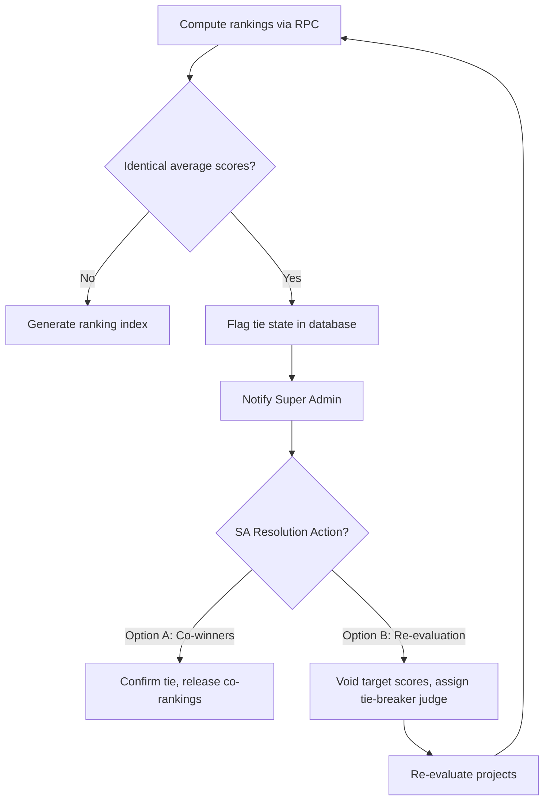

# Reporting & Analytics Document

## Purpose
Define the data aggregation models, ranking calculators, Excel export structures, and auditing dashboard interfaces for the evaluation platform.

## Scope
Covers mathematical models for score compilation, tie-breaking heuristics, SQL aggregation schemas, Excel sheet formats, and administrative dashboard reports.

## Related Documents
- [requirements.md](requirements.md) — Score validation and ranking constraints
- [database.md](database.md) — Schema definitions for scores, criteria, and rankings
- [api.md](api.md) — RPC calls targeting computed results

---

## Score Aggregation & Ranking Math Model

The system aggregates submitted scores to determine rankings per event.

### Math Equation Formulations

Let:
- $J$ be the set of judges who evaluated project $P$.
- $C$ be the set of criteria defined for the event.
- $S_{j,p,c}$ be the raw marks submitted by judge $j \in J$ for project $P$ on criterion $c \in C$.
- $W_c$ be the weight defined for criterion $c \in C$.

#### 1. Weighted Judge Score
The total weighted score assigned by a single judge $j$ to project $P$ is:
$$\text{TotalScore}_{j,p} = \sum_{c \in C} (S_{j,p,c} \times W_c)$$

#### 2. Project Final Average Score
The aggregate score used to rank project $P$ across all judges is the arithmetic mean of the individual judge totals:
$$\text{FinalScore}_p = \frac{1}{|J|} \sum_{j \in J} \text{TotalScore}_{j,p}$$

#### 3. Standard Deviation (Inter-Judge Variance)
To flag evaluations with high discrepancies for SA review:
$$\sigma_p = \sqrt{\frac{1}{|J|} \sum_{j \in J} (\text{TotalScore}_{j,p} - \text{FinalScore}_p)^2}$$

---

## Tie-Breaking Flow

When two or more projects share the exact same $\text{FinalScore}_p$:

- **Database Flag:** Tied rows in the `rankings` table set `is_tied = true`.
- **UI Alert:** Renders a warning icon next to the ranking rank number: "Tie detected. Awaiting administration review."

---

## Excel Export Specification

Super Admins can export event logs. The exported workbook contains four worksheets.

### Workbook Structure

#### Sheet 1: `Leaderboard`
Aggregated overview of project positions.

| Column | Data Type | Description |
| :--- | :--- | :--- |
| `Rank` | Integer | Calculated position. |
| `Project Number` | Integer | Project identifier. |
| `Title` | String | Project title. |
| `Final Average Score` | Decimal | Calculated `FinalScore_p` (2 decimal places). |
| `Judges Count` | Integer | Number of judges who evaluated this project. |
| `Status` | String | Completed / Pending. |

#### Sheet 2: `Judge Scores Detail`
Raw data showing individual score cards.

| Column | Data Type | Description |
| :--- | :--- | :--- |
| `Project Number` | Integer | Project identifier. |
| `Project Title` | String | Project title. |
| `Judge Name` | String | Full name of the judge. |
| `Criterion Name` | String | Name of the evaluated criterion. |
| `Raw Score` | Decimal | Score submitted. |
| `Weight` | Decimal | Criterion weight factor. |
| `Weighted Score` | Decimal | `Raw Score * Weight`. |
| `Void Status` | Boolean | True if score was voided by SA. |

#### Sheet 3: `Registrations`
Complete public signup details.

| Column | Data Type | Description |
| :--- | :--- | :--- |
| `Team Name` | String | Team identifier. |
| `Recovery Email` | String | Contact email. |
| `Submission Time` | Timestamp | Date and time submitted. |
| `Members Count` | Integer | Number of rostered participants. |
| `Dynamic Field Responses` | Text | Dynamic columns created from form fields. |

#### Sheet 4: `Audit Logs`
Full event history for verification.

| Column | Data Type | Description |
| :--- | :--- | :--- |
| `Timestamp` | Timestamp | Date and time of action. |
| `Actor` | String | Name/Email of user performing action. |
| `Action` | String | Action type (e.g. `VOID`, `ROLE_CHANGE`). |
| `Table Affected` | String | Database table. |
| `Old Data` | JSON | Record values before update. |
| `New Data` | JSON | Record values after update. |
| `Reason` | String | Reason supplied by actor. |

---

## Analytics Dashboards

### 1. Judge Consistency Matrix
Visual scatter plot rendering normalized scores across projects. Used to identify "lenient" or "strict" judges.
- **Metric:** Mean score variance per judge compared to event average.
- **Outlier Threshold:** Judges with a variance deviation $> \pm 2\sigma$ are flagged.

### 2. Live Project Scoring Heatmap
Real-time grid visual showing evaluation completeness.
- **Rows:** Anonymized Projects.
- **Columns:** Assigned Judges.
- **Cell Colors:**
  - *Gray:* Unassigned / Pending.
  - *Orange:* Scoring in progress (partial criteria submitted).
  - *Green:* Completed (all criteria locked).
