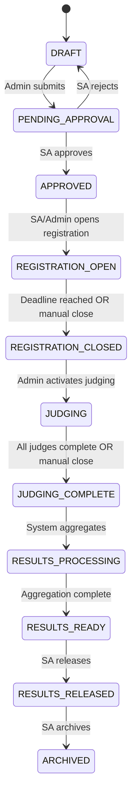

# Requirements Document

## Purpose

Define all functional and non-functional requirements for the Project Judging & Event Evaluation Platform. This document is the authoritative requirements reference for implementation, testing, and validation.

## Scope

Covers every user-facing feature, business rule, validation constraint, and system behavior. Organized by module and cross-referenced with related documents.

## Related Documents

- [context.md](context.md) — Vision, principles, constraints
- [plan.md](plan.md) — Phase-based lifecycle
- [userflow.md](userflow.md) — Role-specific workflows
- [architecture.md](architecture.md) — System design
- [database.md](database.md) — Schema and constraints
- [api.md](api.md) — Endpoint specification
- [security.md](security.md) — Auth and RBAC
- [ui-spec.md](ui-spec.md) — Page-level UI requirements

---

## Roles Summary

| Role | Authentication | Platform | Permissions |
|---|---|---|---|
| Super Admin (SA) | Google OAuth | Desktop | Full system control |
| Admin | Google OAuth | Desktop | Event management, team/judge management |
| Judge | Google OAuth | Mobile-optimized | Evaluate projects only |
| Maintainer | Google OAuth | Desktop | Technical maintenance only |
| Team (Registrant) | None (public) | Any device | Public registration |

---

## FR-100: Authentication & User Management

### FR-101: Google OAuth Login

- All authenticated users (SA, Admin, Judge, Maintainer) log in via Google OAuth through Supabase Auth.
- No email/password authentication.
- No social logins other than Google.

### FR-102: Automatic Judge Account Creation

- When a user logs in with Google for the first time, a `profile` record is created with `role = 'JUDGE'` and `status = 'PENDING'`.
- The judge cannot access any functionality until an Admin or SA sets `status = 'APPROVED'`.

### FR-103: User Role Assignment

- SA can assign any role: `SUPER_ADMIN`, `ADMIN`, `JUDGE`, `MAINTAINER`.
- SA can revoke any role.
- SA can delegate permission to Admin to manage judges.
- Admin can approve/reject pending judges.
- Admin cannot promote users to Admin or SA.

### FR-104: Session Management

- Sessions managed via Supabase Auth JWT.
- JWT contains `user_id`; role is injected into `app_metadata.role` via the `public.custom_access_token_hook` PostgreSQL function — **do not re-query the `profiles` table for role on each request**.
- Session expiry: configurable (default 7 days).
- Soft revoke: set `status = 'SUSPENDED'` in `profiles`; middleware checks status on every request.

### FR-105: User Profile

- Fields: `id`, `email`, `full_name`, `avatar_url`, `role`, `status`, `created_at`, `updated_at`.
- Profile is auto-created on first OAuth login.
- SA can edit any profile.
- Users can view their own profile.

**Business Rules:**
- A user may have exactly one role at any time.
- Role changes are audit-logged.
- Suspended users are denied all access immediately (middleware check).

**Validation Rules:**
- `role` must be one of: `SUPER_ADMIN`, `ADMIN`, `JUDGE`, `MAINTAINER`.
- `status` must be one of: `PENDING`, `APPROVED`, `SUSPENDED`, `REJECTED`.
- `email` must be unique.

---

## FR-200: Event Management

### FR-201: Event Creation

- Admin creates an event draft.
- Required fields: `name`, `description`, `event_type`, `start_date`, `end_date`.
- Optional fields: `min_team_size`, `max_team_size`, `scoring_precision`, `custom_config`.
- Event starts in `DRAFT` status.

### FR-202: Event Types

Supported event types (enum):

| Type | Description |
|---|---|
| `HACKATHON` | Multi-day coding competition |
| `PROJECT_COMPETITION` | Project showcase and evaluation |
| `STARTUP_PITCH` | Business pitch evaluation |
| `ROBOTICS` | Robotics demonstration |
| `RESEARCH_PAPER` | Academic paper review |
| `POSTER_PRESENTATION` | Poster-based evaluation |
| `INNOVATION_CHALLENGE` | Innovation showcase |
| `CUSTOM` | User-defined type |

### FR-203: Event Configuration

Each event independently configures:

| Setting | Type | Default |
|---|---|---|
| `min_team_size` | integer | 1 |
| `max_team_size` | integer | 5 |
| `scoring_precision` | enum: `INTEGER`, `DECIMAL` | `INTEGER` |
| `registration_deadline` | timestamp | required |
| `judging_start` | timestamp | null |
| `judging_end` | timestamp | null |
| `results_visibility` | enum: `HIDDEN`, `RANKING_ONLY`, `SELF_SCORE`, `FULL_LEADERBOARD` | `HIDDEN` |
| `allow_late_registration` | boolean | false |

### FR-204: Event Approval

- Admin submits event for SA approval.
- SA approves or rejects with optional comment.
- Only approved events can proceed to registration phase.
- Approval is audit-logged.

### FR-205: Event Phase Transitions

**Business Rules:**
- Phase transitions are one-directional (no rollback except SA void).
- Each transition is audit-logged.
- Only SA can force-transition (e.g., close judging early).
- Admin can transition: `APPROVED → REGISTRATION_OPEN`, `REGISTRATION_CLOSED → JUDGING`.

### FR-206: Event Deletion

- Events in `DRAFT` status can be deleted by Admin.
- Events in any other status can only be archived by SA.
- Archived events retain all data.
- Deletion is soft-delete (`deleted_at` timestamp).

---

## FR-300: Registration Form Builder

### FR-301: Form Creation

- SA creates registration forms linked to an event.
- Form builder supports adding/removing/reordering fields.
- Each field has: `label`, `field_type`, `required`, `options`, `validation`, `placeholder`, `help_text`, `order`.

### FR-302: Supported Field Types

| Field Type | Description | Options |
|---|---|---|
| `SHORT_TEXT` | Single-line text input | `max_length` |
| `LONG_TEXT` | Multi-line textarea | `max_length` |
| `EMAIL` | Email input with validation | — |
| `PHONE` | Phone number input | `country_code` |
| `NUMBER` | Numeric input | `min`, `max`, `step` |
| `DROPDOWN` | Select from options | `choices[]` |
| `RADIO` | Single selection | `choices[]` |
| `CHECKBOX` | Multiple selection | `choices[]` |
| `DATE` | Date picker | `min_date`, `max_date` |
| `TIME` | Time picker | — |
| `FILE_UPLOAD` | File attachment | `accepted_types[]`, `max_size_mb` |
| `URL` | URL input with validation | — |
| `SECTION_HEADER` | Non-input visual separator | — |

### FR-303: Form Edit Window

- Forms are editable for a configurable period after publish (default: 1–2 days).
- After the edit window closes, form structure is locked.
- Only SA can extend the edit window (audit-logged).
- Locked forms: field additions/removals/reorders are blocked. Only content updates (help text, descriptions) are allowed.

### FR-304: Form Validation Rules

- Each field can have custom validation rules defined by SA.
- Required fields must be filled before final submission.
- File uploads validate: type, size.
- Email fields validate format.
- URL fields validate format.

**Business Rules:**
- One form per event.
- Form must exist before registration can open.
- Form structure is immutable after lock.
- SA edit window extension is audit-logged with reason.

---

## FR-400: Registration

### FR-401: Public Access

- Registration is public. No login required.
- Registration page is accessible via a shareable URL: `/register/{event_slug}`.

### FR-402: Draft System

- On first visit, user creates a draft registration.
- System returns: `draft_id` and optionally stores `recovery_email`.
- Draft is editable until final submission.
- Draft data is saved automatically (autosave every 30 seconds).

### FR-403: Draft Recovery

Two recovery methods:

1. **Email Recovery**: User enters email → system sends a recovery link containing the `draft_id`.
2. **Draft ID Recovery**: User enters `draft_id` directly.

### FR-404: Final Submission

- User clicks "Submit" → confirmation dialog.
- On confirmation:
  - `status` changes from `DRAFT` to `SUBMITTED`.
  - Record becomes read-only.
  - Timestamp recorded.
  - Confirmation email sent (if email provided).

### FR-405: Team Information

- Registration form includes team name and team members.
- Team size must be within event's `min_team_size` and `max_team_size`.
- Each team member has: `name`, `email` (optional), `role` (optional).

### FR-406: Submission Attachments

Configurable per event. Supported types:

| Type | Format |
|---|---|
| Documents | PDF, DOC, DOCX |
| Presentations | PPT, PPTX |
| Archives | ZIP |
| Images | PNG, JPG, JPEG, GIF, WEBP |
| URLs | GitHub URL, Website URL, Video URL |
| Custom | Any field defined in form builder |

- All file uploads go to Supabase Storage bucket `submissions`.
- Max file size: configurable per field (default 10 MB).
- Multiple files supported per field if configured.

**Business Rules:**
- Registration is only open during the registration phase.
- Late registrations blocked unless `allow_late_registration` is true.
- Submitted registrations cannot be edited.
- One registration per team per event.
- Draft registrations expire 7 days after the registration deadline.

**Validation Rules:**
- All required fields must be filled.
- Team size within configured limits.
- File types match accepted types.
- File sizes within limits.
- Email format validation.
- URL format validation.

**Error Handling:**
- File upload failure: retry with exponential backoff; show user-friendly error.
- Duplicate email in same event: warning (not blocking; teams may share contacts).
- Expired draft: show message with option to start new registration.

---

## FR-500: Submissions

### FR-501: Submission Types

Each event configures what submission types are accepted. Submissions are collected as part of the registration form (FR-302 fields) or as a separate post-registration step if configured.

### FR-502: File Storage

- Files uploaded to Supabase Storage bucket `submissions/{event_id}/{registration_id}/`.
- Signed URLs generated for authorized access.
- Files are immutable after final submission.

### FR-503: Submission Viewing

- Admin can view all submissions for an event.
- SA can view all submissions across all events.
- Judges see only `title` and `abstract` (never file submissions or team identity).

---

## FR-600: Judging

### FR-601: Judge Onboarding

- Judge logs in via Google OAuth.
- Account auto-created with `status = 'PENDING'`.
- Admin approves judge → `status = 'APPROVED'`.
- Approved judges can access assigned events.

### FR-602: Event Assignment

- Admin assigns judges to events.
- All judges evaluate all projects in their assigned event.
- Judge sees a list of all projects (anonymized).

### FR-603: Anonymous Judging

- Judge sees only:
  - Project title
  - Abstract/description
- Judge never sees:
  - Team name
  - Team members
  - Registration details
  - Submission files (unless explicitly configured by SA)

### FR-604: Project Access

Two methods for judges to open a project:

1. **QR Code Scan**: Camera scans QR code printed on project display.
2. **Project Number**: Manual entry of project number.

### FR-605: QR Code Generation

- QR codes are generated automatically after registration closes.
- Each project gets a unique QR code containing the project ID.
- QR codes are compiled into a printable PDF (one per page or grid layout).
- PDF stored in Supabase Storage bucket `qr-codes`.

### FR-606: Judge Preloading

- When a judge accesses an event, the system preloads:
  - Event configuration (criteria, scoring precision).
  - Project list (title + abstract only).
  - Judge's progress (which projects are evaluated).
- This enables offline-resilient judging on mobile.

**Business Rules:**
- All judges evaluate all projects (no partial assignment).
- Judge cannot skip a project.
- Judge progress is tracked per event.
- Judge can evaluate projects in any order.
- Once all criteria for a project are submitted, the project is locked for that judge.

---

## FR-700: Scoring

### FR-701: Rubric / Criteria Definition

- SA defines evaluation criteria per event.
- Each criterion has: `name`, `description`, `min_marks`, `max_marks`, `weight`, `order`.
- Criteria are ordered; judges evaluate sequentially.

### FR-702: Sequential Evaluation

- Judge evaluates one criterion at a time.
- Cannot proceed to next criterion until current criterion is submitted.
- Each criterion submission is individually locked.

### FR-703: Score Input

- Score must be between `min_marks` and `max_marks` (inclusive).
- Scoring precision follows event configuration:
  - `INTEGER`: whole numbers only.
  - `DECIMAL`: up to 2 decimal places.

### FR-704: Score Immutability

- Once a score is submitted, it cannot be modified by anyone.
- Database enforces this via:
  - UNIQUE constraint on `(judge_id, project_id, criterion_id)`.
  - RLS policy: no UPDATE on `scores` table.
  - No DELETE RLS policy on `scores` table.
- The only override: SA can void an entire evaluation (all criteria for one judge-project pair) and trigger re-evaluation.

### FR-705: Voiding an Evaluation

- SA can void a judge's evaluation of a specific project.
- Voiding sets `voided = true` on all scores for that judge-project pair.
- Voided scores are excluded from aggregation.
- Judge is notified and must re-evaluate.
- Void action is audit-logged with mandatory reason.

### FR-706: Evaluation Completion

- When a judge submits scores for all criteria of a project, the project is marked complete for that judge.
- Judge cannot reopen or re-evaluate a completed project (unless voided by SA).
- When all judges complete all projects, the event moves to `JUDGING_COMPLETE`.

**Business Rules:**
- Scores are immutable after submission.
- SA cannot directly modify a submitted score (can only void and require re-evaluation).
- Score aggregation uses non-voided scores only.
- Sequential evaluation enforced: criterion N must be submitted before criterion N+1 is accessible.

**Validation Rules:**
- `marks >= criterion.min_marks`
- `marks <= criterion.max_marks`
- Integer precision: `marks == floor(marks)` when `scoring_precision = 'INTEGER'`.
- Decimal precision: `marks` has at most 2 decimal places when `scoring_precision = 'DECIMAL'`.
- `judge_id` must match authenticated user.
- `project_id` must belong to the event the judge is assigned to.
- `criterion_id` must belong to the event.
- Previous criteria in order must already be scored.

**Edge Cases:**
- Judge loses network mid-evaluation: score not submitted; criterion remains open; judge retries.
- Judge submits duplicate: UNIQUE constraint rejects; UI shows "already scored".
- SA voids evaluation while judge is mid-evaluation: judge sees notification on next action; voided criteria cleared.

---

## FR-800: Results & Rankings

### FR-801: Score Aggregation

- System aggregates scores per project:
  - Weighted sum: `Σ (score * criterion.weight)` for each judge.
  - Total per judge per project.
  - Average across all judges per project.

### FR-802: Ranking

- Projects ranked by average weighted total score (descending).
- Rank is per event.

### FR-803: Tie-Breaking

- If two or more projects have identical average scores:
  - System flags a tie.
  - SA is notified.
  - SA can trigger re-evaluation for tied projects.
  - Re-evaluation: SA voids existing scores for tied projects and reassigns judges.

### FR-804: Result Visibility

- Results are hidden by default (`results_visibility = 'HIDDEN'`).
- SA controls visibility mode per event:

| Mode | Who Sees What |
|---|---|
| `HIDDEN` | Nobody sees results |
| `RANKING_ONLY` | Judges/Admin see rank order without scores |
| `SELF_SCORE` | Judges see their own submitted scores only |
| `FULL_LEADERBOARD` | All scores and rankings visible to Judges/Admin |

- Visibility change is audit-logged.

### FR-805: Result Release

- SA explicitly releases results.
- Release is a one-time action per event (can be toggled back to HIDDEN).
- Notification sent to all judges and admins when results are released.

**Business Rules:**
- Results are computed automatically when event reaches `JUDGING_COMPLETE`.
- Ranking recalculates when a void/re-evaluation occurs.
- Tie resolution requires SA intervention.
- Result visibility changes are reversible by SA.

---

## FR-900: Audit & Export

### FR-901: Audit Log

Every sensitive action is logged:

| Action Category | Examples |
|---|---|
| Auth | Login, logout, role change |
| Event | Create, approve, phase transition, config change |
| Registration | Draft created, submitted, recovered |
| Form | Created, edited, locked, deadline extended |
| Judging | Score submitted, evaluation voided, re-evaluation triggered |
| Results | Aggregation run, visibility changed, results released |
| User | Profile updated, status changed, role assigned |

Audit log fields:
- `id`, `actor_id`, `action`, `table_name`, `record_id`, `old_data` (JSONB), `new_data` (JSONB), `ip_address`, `user_agent`, `reason`, `created_at`.

### FR-902: Export

- SA can export full audit data as Excel.
- Export includes:
  - All scores (judge-wise breakdown).
  - Event metadata.
  - Registration data.
  - Audit log.
- Export files stored in Supabase Storage bucket `exports`.

---

## FR-1000: Notifications

### FR-1001: Email Notifications

Triggered automatically:

| Event | Recipients |
|---|---|
| Judge account approved | Judge |
| Judge account rejected | Judge |
| Event approved | Admin who created it |
| Registration submitted | Team (if email provided) |
| Draft recovery requested | Team email |
| Evaluation voided | Judge |
| Results released | All judges + admins for the event |
| Deadline extended | All admins for the event |

### FR-1002: Provider Abstraction

- Email sending uses a provider interface.
- Default: Supabase Edge Function + Resend/SendGrid/SMTP.
- Swappable without code changes (environment variable config).

---

## FR-1100: AI Features (Optional)

### FR-1101: Rubric Suggestions

- SA can request AI-generated rubric criteria based on event type and description.
- Suggestions are editable; SA has full control.

### FR-1102: Form Suggestions

- SA can request AI-suggested form fields based on event type.

### FR-1103: Wording Improvements

- SA can request AI rewording of criteria descriptions, form labels, email templates.

### FR-1104: Summaries

- SA can request AI-generated event summary from scores data.

### FR-1105: Email Drafting

- SA can request AI-drafted notification emails.

**Business Rules:**
- AI never influences scoring or ranking.
- AI features gated behind `AI_ENABLED` feature flag.
- All AI interactions are audit-logged.

---

## Non-Functional Requirements

### NFR-01: Performance

| Metric | Target |
|---|---|
| Page load time (desktop) | < 2 seconds |
| Page load time (mobile) | < 3 seconds |
| API response time (p95) | < 500ms |
| Score submission latency | < 300ms |
| Concurrent judges supported | 100+ per event |
| File upload (10 MB) | < 10 seconds |

### NFR-02: Reliability

- System availability: 99.9% during active events.
- Data durability: Supabase managed backups (daily).
- Score immutability enforced at database level.
- Graceful degradation: offline-capable scoring UI (queue and sync).

### NFR-03: Security

- HTTPS everywhere.
- RLS on every table.
- JWT validation on every authenticated request.
- No client-side role escalation possible.
- Audit trail for all sensitive actions.
- See [security.md](security.md) for full specification.

### NFR-04: Usability

- Mobile-first design for judge interface.
- Desktop-optimized for admin/SA dashboards.
- Accessible (WCAG 2.1 AA compliance target).
- Responsive breakpoints: 320px, 768px, 1024px, 1440px.

### NFR-05: Scalability

- Support 50+ concurrent events.
- Support 500+ registrations per event.
- Support 50+ judges per event.
- Database connection pooling via PgBouncer.

### NFR-06: Maintainability

- TypeScript strict mode.
- Comprehensive type coverage.
- Modular code organization.
- Documented API contracts.
- Automated testing (unit, integration, E2E).
