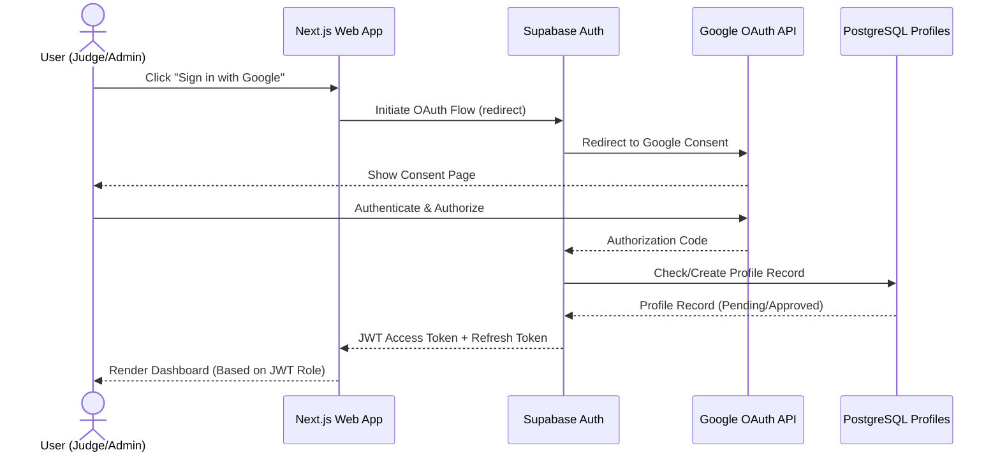

# Security Document

## Purpose
Define the complete security design, access control matrices, authentication protocols, row-level security (RLS) configurations, session validation procedures, audit log mechanisms, and threat mitigation models for the Project Judging & Event Evaluation Platform.

## Scope
Covers identity management, authorization mechanics, network-level constraints, storage security policies, RLS statements, audit tracking, data minimization, and mitigation plans for common attack vectors (OWASP Top 10).

## Related Documents
- [architecture.md](architecture.md) — System boundaries and module topology
- [requirements.md](requirements.md) — Feature definitions and business constraints
- [database.md](database.md) — Schema definitions and relational tables

---

## Identity & Authentication

All admin, judge, and maintainer accounts authenticate exclusively via **Google OAuth 2.0** integrated through Supabase Auth.
- No username/password authentication is exposed or allowed.
- No local password hashing, recovery, or key storage operations are performed on application servers.
- Anonymous registration forms do not require authentication but use a generated single-use cryptographically secure `draft_id` for authorization.

### Authentication Flow


### JWT Claims & Session Lifetime
The Supabase JWT contains custom claims injected into the access token payload, including the user's role from the database.
- **Access Token (JWT) Lifetime:** 3600 seconds (1 hour).
- **Refresh Token Lifetime:** 604800 seconds (7 days), stored in secure, HttpOnly, SameSite=Strict cookies.
- **Session Revocation:** Status updates in the `profiles` table to `SUSPENDED` instantly block API execution, as all PostgreSQL functions and RLS policies evaluate the real-time status column.

---

## Authorization & Role-Based Access Control (RBAC)

The system uses a strict hierarchical Role-Based Access Control (RBAC) model. Roles are defined in the database as a postgres enum type `user_role` and mapped to individual permissions.

### Role Definition Matrix

| Action / Capability | Super Admin | Admin | Judge | Maintainer | Anonymous (Public) |
| :--- | :---: | :---: | :---: | :---: | :---: |
| Edit System Settings | Yes | No | No | No | No |
| Create Admins/Judges/Maintainers | Yes | No | No | No | No |
| Approve Event Creation | Yes | No | No | No | No |
| Create Event Drafts | Yes | Yes | No | No | No |
| Edit Event Drafts | Yes | Yes | No | No | No |
| Assign Judges to Events | Yes | Yes | No | No | No |
| Manage Team Rosters | Yes | Yes | No | No | No |
| View Registration Submissions | Yes | Yes | No | No | No |
| Create/Edit Registration Forms | Yes | No | No | No | No |
| Extend Registration Deadlines | Yes | No | No | No | No |
| Evaluate Assigned Projects | No | No | Yes | No | No |
| Void Score / Trigger Re-Evaluation| Yes | No | No | No | No |
| Aggregate Scores / Run Ranking | Auto | Auto | No | No | No |
| Release / Un-release Results | Yes | No | No | No | No |
| View Leaderboard & Scores | Yes | Yes | Yes* | No | No |
| View Technical Environment Logs | Yes | No | No | Yes | No |
| Access Public Registration Form | Yes | Yes | Yes | Yes | Yes |
| Create/Edit Registration Draft | No | No | No | No | Yes |

*\*Only if results_visibility is set to a mode other than HIDDEN by the Super Admin.*

---

## Row-Level Security (RLS) Specification

Row-Level Security is enabled on every table in the PostgreSQL database. RLS policies act as the primary defense-in-depth mechanism.

### Policies Configuration Statements

```sql
-- Enable RLS on all tables
ALTER TABLE profiles ENABLE ROW LEVEL SECURITY;
ALTER TABLE events ENABLE ROW LEVEL SECURITY;
ALTER TABLE forms ENABLE ROW LEVEL SECURITY;
ALTER TABLE form_fields ENABLE ROW LEVEL SECURITY;
ALTER TABLE registrations ENABLE ROW LEVEL SECURITY;
ALTER TABLE registration_responses ENABLE ROW LEVEL SECURITY;
ALTER TABLE team_members ENABLE ROW LEVEL SECURITY;
ALTER TABLE projects ENABLE ROW LEVEL SECURITY;
ALTER TABLE criteria ENABLE ROW LEVEL SECURITY;
ALTER TABLE scores ENABLE ROW LEVEL SECURITY;
ALTER TABLE event_judges ENABLE ROW LEVEL SECURITY;
ALTER TABLE rankings ENABLE ROW LEVEL SECURITY;
ALTER TABLE audit_logs ENABLE ROW LEVEL SECURITY;
```

#### Profiles Table Policies
```sql
-- Read profiles
CREATE POLICY "Profiles are readable by approved users" ON profiles
  FOR SELECT USING (
    status = 'APPROVED' 
    OR auth.uid() = id 
    OR EXISTS (
      SELECT 1 FROM profiles 
      WHERE id = auth.uid() AND role IN ('SUPER_ADMIN', 'ADMIN')
    )
  );

-- Self profile update
CREATE POLICY "Users can update own details" ON profiles
  FOR UPDATE USING (auth.uid() = id)
  WITH CHECK (
    auth.uid() = id 
    AND role = (SELECT role FROM profiles WHERE id = auth.uid()) 
    AND status = (SELECT status FROM profiles WHERE id = auth.uid())
  );

-- Role management (SA only)
CREATE POLICY "Super Admins can update roles" ON profiles
  FOR UPDATE USING (
    EXISTS (SELECT 1 FROM profiles WHERE id = auth.uid() AND role = 'SUPER_ADMIN')
  );

-- Judge onboarding approval (Admin can approve/reject pending judges)
CREATE POLICY "Admins can approve pending judges" ON profiles
  FOR UPDATE USING (
    EXISTS (SELECT 1 FROM profiles WHERE id = auth.uid() AND role = 'ADMIN')
  )
  WITH CHECK (
    role = 'JUDGE' 
    AND status IN ('APPROVED', 'REJECTED')
  );
```

#### Events Table Policies
```sql
CREATE POLICY "Events select policy" ON events
  FOR SELECT USING (
    deleted_at IS NULL AND (
      EXISTS (SELECT 1 FROM profiles WHERE id = auth.uid() AND role IN ('SUPER_ADMIN', 'ADMIN'))
      OR (status IN ('REGISTRATION_OPEN', 'RESULTS_RELEASED'))
      OR (status = 'JUDGING' AND EXISTS (
        SELECT 1 FROM event_judges WHERE event_id = events.id AND judge_id = auth.uid()
      ))
    )
  );

CREATE POLICY "Admins and SA can manage events" ON events
  FOR ALL USING (
    EXISTS (SELECT 1 FROM profiles WHERE id = auth.uid() AND role IN ('SUPER_ADMIN', 'ADMIN'))
  );
```

#### Scores Table Policies (Immutable Configuration)
```sql
-- Read scores: Admin/SA or the Judge who submitted them
CREATE POLICY "Scores readable by authorized users" ON scores
  FOR SELECT USING (
    judge_id = auth.uid() 
    OR EXISTS (SELECT 1 FROM profiles WHERE id = auth.uid() AND role IN ('SUPER_ADMIN', 'ADMIN'))
  );

-- Insert score: Enforced check to ensure judge is assigned to event and status is JUDGING
CREATE POLICY "Judges can submit scores" ON scores
  FOR INSERT WITH CHECK (
    judge_id = auth.uid()
    AND EXISTS (
      SELECT 1 FROM profiles 
      WHERE id = auth.uid() AND role = 'JUDGE' AND status = 'APPROVED'
    )
    AND EXISTS (
      SELECT 1 FROM event_judges 
      WHERE event_id = scores.event_id AND judge_id = auth.uid()
    )
    AND EXISTS (
      SELECT 1 FROM events 
      WHERE id = scores.event_id AND status = 'JUDGING'
    )
  );

-- SA can void scores by setting voided to true (No other fields can be changed)
CREATE POLICY "SA can void scores" ON scores
  FOR UPDATE USING (
    EXISTS (SELECT 1 FROM profiles WHERE id = auth.uid() AND role = 'SUPER_ADMIN')
  )
  WITH CHECK (voided = true);

-- No DELETE policy defined. Scores can never be deleted from the database.
```

#### Audit Logs Table Policies (Append-Only)
```sql
-- Read audit logs (SA only)
CREATE POLICY "Only SA can read audit logs" ON audit_logs
  FOR SELECT USING (
    EXISTS (SELECT 1 FROM profiles WHERE id = auth.uid() AND role = 'SUPER_ADMIN')
  );

-- Write audit logs (Backend service-role triggers only, client access blocked)
CREATE POLICY "Service-role insert only" ON audit_logs
  FOR INSERT WITH CHECK (false);

-- No UPDATE or DELETE policies
```

#### Registrations Table Policies
```sql
-- Public can insert drafts (anon key)
CREATE POLICY "registrations_insert_public" ON registrations FOR INSERT
  WITH CHECK (status = 'DRAFT');

-- Public can read/update own drafts via draft_id sent in x-draft-id header
CREATE POLICY "registrations_select_public" ON registrations FOR SELECT
  USING (status = 'DRAFT' AND draft_id = current_setting('request.headers', true)::json->>'x-draft-id');

-- Admin/SA can read all
CREATE POLICY "registrations_select_admin" ON registrations FOR SELECT
  USING (EXISTS (SELECT 1 FROM profiles WHERE id = auth.uid() AND role IN ('SUPER_ADMIN', 'ADMIN')));
```

#### Projects Table Policies
```sql
-- Readable by approved event judges, admins, or SAs
CREATE POLICY "projects_select" ON projects FOR SELECT
  USING (
    EXISTS (SELECT 1 FROM profiles WHERE id = auth.uid() AND role IN ('SUPER_ADMIN', 'ADMIN'))
    OR EXISTS (SELECT 1 FROM event_judges WHERE event_id = projects.event_id AND judge_id = auth.uid())
  );

-- Admins/SA can manage projects
CREATE POLICY "projects_manage" ON projects FOR ALL
  USING (EXISTS (SELECT 1 FROM profiles WHERE id = auth.uid() AND role IN ('SUPER_ADMIN', 'ADMIN')));
```

#### Forms & Form Fields Table Policies
```sql
-- Readable by anyone
CREATE POLICY "forms_select" ON forms FOR SELECT USING (true);
CREATE POLICY "form_fields_select" ON form_fields FOR SELECT USING (true);

-- Managed by Admin/SA
CREATE POLICY "forms_manage" ON forms FOR ALL
  USING (EXISTS (SELECT 1 FROM profiles WHERE id = auth.uid() AND role IN ('SUPER_ADMIN', 'ADMIN')));
CREATE POLICY "form_fields_manage" ON form_fields FOR ALL
  USING (EXISTS (SELECT 1 FROM profiles WHERE id = auth.uid() AND role IN ('SUPER_ADMIN', 'ADMIN')));
```

#### Criteria Table Policies
```sql
-- Readable by anyone
CREATE POLICY "criteria_select" ON criteria FOR SELECT USING (true);

-- Managed by Admin/SA
CREATE POLICY "criteria_manage" ON criteria FOR ALL
  USING (EXISTS (SELECT 1 FROM profiles WHERE id = auth.uid() AND role IN ('SUPER_ADMIN', 'ADMIN')));
```

#### Team Members & Registration Responses Table Policies
```sql
-- Readable/managed by Admins/SA, or public matching draft_id header
CREATE POLICY "team_members_select" ON team_members FOR SELECT
  USING (
    EXISTS (SELECT 1 FROM profiles WHERE id = auth.uid() AND role IN ('SUPER_ADMIN', 'ADMIN'))
    OR EXISTS (
      SELECT 1 FROM registrations r
      WHERE r.id = team_members.registration_id
      AND r.status = 'DRAFT'
      AND r.draft_id = current_setting('request.headers', true)::json->>'x-draft-id'
    )
  );

CREATE POLICY "team_members_modify" ON team_members FOR ALL
  USING (
    EXISTS (SELECT 1 FROM profiles WHERE id = auth.uid() AND role IN ('SUPER_ADMIN', 'ADMIN'))
    OR EXISTS (
      SELECT 1 FROM registrations r
      WHERE r.id = team_members.registration_id
      AND r.status = 'DRAFT'
      AND r.draft_id = current_setting('request.headers', true)::json->>'x-draft-id'
    )
  );

CREATE POLICY "registration_responses_select" ON registration_responses FOR SELECT
  USING (
    EXISTS (SELECT 1 FROM profiles WHERE id = auth.uid() AND role IN ('SUPER_ADMIN', 'ADMIN'))
    OR EXISTS (
      SELECT 1 FROM registrations r
      WHERE r.id = registration_responses.registration_id
      AND r.status = 'DRAFT'
      AND r.draft_id = current_setting('request.headers', true)::json->>'x-draft-id'
    )
  );

CREATE POLICY "registration_responses_modify" ON registration_responses FOR ALL
  USING (
    EXISTS (SELECT 1 FROM profiles WHERE id = auth.uid() AND role IN ('SUPER_ADMIN', 'ADMIN'))
    OR EXISTS (
      SELECT 1 FROM registrations r
      WHERE r.id = registration_responses.registration_id
      AND r.status = 'DRAFT'
      AND r.draft_id = current_setting('request.headers', true)::json->>'x-draft-id'
    )
  );
```

#### Event Judges Table Policies
```sql
-- Readable by Admins/SA, or the Judge themselves
CREATE POLICY "event_judges_select" ON event_judges FOR SELECT
  USING (
    EXISTS (SELECT 1 FROM profiles WHERE id = auth.uid() AND role IN ('SUPER_ADMIN', 'ADMIN'))
    OR judge_id = auth.uid()
  );

-- Managed by Admins/SA
CREATE POLICY "event_judges_manage" ON event_judges FOR ALL
  USING (EXISTS (SELECT 1 FROM profiles WHERE id = auth.uid() AND role IN ('SUPER_ADMIN', 'ADMIN')));
```

#### Rankings Table Policies
```sql
-- Readable by Admin/SA, or if the event results are released
CREATE POLICY "rankings_select" ON rankings FOR SELECT
  USING (
    EXISTS (SELECT 1 FROM profiles WHERE id = auth.uid() AND role IN ('SUPER_ADMIN', 'ADMIN'))
    OR EXISTS (
      SELECT 1 FROM events e
      WHERE e.id = rankings.event_id
      AND e.status = 'RESULTS_RELEASED'
      AND e.results_visibility != 'HIDDEN'
    )
  );
```
```

---

## Public Registration Protection (Anonymous Forms)

Public registration forms are exposed to unauthenticated users. To secure this interface, the system implements:

### Single-Use Draft Mechanism
1. The client POSTs to `/api/registrations` containing a `recovery_email`.
2. The database generates a cryptographically random, collision-resistant string token as a `draft_id` (via `nanoid()`).
3. Subsequent operations (saving drafts, uploading files, retrieving responses) require passing the `draft_id` as an authorization token (sent via the `x-draft-id` header).
4. Once the team submits the final form, the `status` column is updated to `SUBMITTED`, locking the record. The RLS policy blocks any further updates to records in `SUBMITTED` status.

### File Upload Restrictions
- All file uploads are directed to Supabase Storage inside the `submissions/` bucket.
- Upload paths are formatted as: `submissions/{event_id}/{registration_id}/{field_id}/{filename}`.
- Storage policies restrict writing files unless the payload matches the active registration ID:
```sql
CREATE POLICY "Allow public uploads matching draft_id" ON storage.objects
  FOR INSERT WITH CHECK (
    bucket_id = 'submissions' 
    AND (
      EXISTS (
        SELECT 1 FROM registrations 
        WHERE id::text = (storage.foldername(name))[2] 
        AND status = 'DRAFT'
      )
    )
  );
```

---

## Threat Modeling & Mitigation Plans

| Threat Vector | Target | Mitigation Strategy |
| :--- | :--- | :--- |
| **SQL Injection** | PostgreSQL DB | Use PostgreSQL parameterized queries natively generated by the Supabase Client / PostgREST. Dynamic queries within custom RPC functions are heavily discouraged; if required, they must use `quote_ident()` and `quote_literal()`. |
| **Cross-Site Scripting (XSS)** | Next.js Frontend | React's default safe string escaping is enforced. Strict Content Security Policy (CSP) headers block execution of inline scripts and untrusted external scripts. |
| **Privilege Escalation** | Supabase API | Application layer role checks in Next.js Server Components are coupled with database-level RLS policies. Custom claims in the JWT are verified at the db schema layer, preventing client-side header manipulation from elevating privileges. |
| **Score Tampering** | Scores Table | The RLS configuration excludes `UPDATE` (except for the `voided` column by SAs) and completely blocks `DELETE` operations on the scores table. Unique constraint on `(judge_id, project_id, criterion_id)` blocks duplicate submissions. |
| **Denial of Service (DoS)** | Public Forms | IP-based rate limiting via Next.js middleware using Upstash Redis. File size limitations are checked on the client and strictly validated in Supabase Storage before write confirmation. |
| **Data Leakage (Team Names)** | Judge Portal | The database view `anonymized_projects` contains only the `title` and `abstract`. Judges are strictly blocked via RLS policies from querying the `registrations` or `team_members` tables. |
| **CSRF Attacks** | Authenticated Requests | Session cookies are configured with `SameSite=Strict` and `Secure`. Supabase client libraries handle stateless authorization headers dynamically, eliminating standard session cookie hijacking vectors. |
| **Unapproved Judge Access** | Judging System | Automatic profile creation puts judges into `PENDING` status. The RLS policies for events, projects, and scores explicitly require the judge profile status to be `APPROVED`. |
